# Atlas 16 – Ein FPGA-Computer im Stil von Nand2Tetris
### Lehrbuch und Bauanleitung

**Autor:** Sebastian Schwiebert
**Unterstützung:** KI-Assistent (Claude, Anthropic)
**Erstellt:** 2026-03-07 | **Aktualisiert:** 2026-04-15

**Plattform:**
- Terasic DE10-Nano (Intel Cyclone V SoC FPGA)
- MiSTer SDRAM XSD 2.5 (2× AS4C32M16SB-7TCN = 128 MB)
- Intel Quartus Prime 25.1 SC Lite Edition
- SystemVerilog IEEE 1800-2005

> **Voraussetzung:** Dieses Buch setzt den Abschluss des Kurses
> *Nand2Tetris* voraus, der im Buch *The Elements of Computing Systems*
> von Nisan und Schocken beschrieben ist (im Folgenden: **[N2T]**).<br>
> Nisan, N. & Schocken, S. (2005/2021). *The Elements of Computing Systems:
> Building a Modern Computer from First Principles* (2. Aufl.). MIT Press.

---

# Vorwort

Meine erste Begegnung mit digitaler Schaltungstechnik fand nicht am Computer statt, sondern an einem Lötkolben.

An der Heinrich-Hertz-Kollegschule in Düsseldorf bauten wir im Werkunterricht einen Computer auf Basis des Zilog Z80 — nicht den Prozessor selbst, sondern die Hardware drum herum: Adressdekoder, Speicheranbindung, Ein- und Ausgabeschnittstellen. Wir lernten, wie aus einzelnen Flipflops Register werden, wie Zähler ticken und warum Timing in der Digitalelektronik keine Nebensache ist. Wer einen Flipflop falsch verdrahtet, bemerkt das schnell — und nicht immer schmerzlos. Erste digitale Schaltungen simulierten wir auf dem Atari ST, lange bevor es für Studenten erschwingliche FPGA-Boards gab. Es war eine andere Zeit — langsamer, tastbarer, in gewisser Weise ehrlicher.

Jahre später, als Mikrocontroller für jedermann erschwinglich wurden, fand ich den Weg zurück. Mit dem Arduino begann es, einem kleinen Board das mehr Fragen aufwirft als es beantwortet. Dann der ESP32, der erste ernsthafte Blick auf drahtlose Protokolle und Echtzeitanforderungen. Und schließlich das FPGA — der Punkt an dem mir klar wurde, dass ich nicht nur Programme schreiben, sondern Hardware denken wollte. Die Erinnerungen an die Kollegschule kamen dabei zurück, aber diesmal mit Werkzeugen die damals undenkbar gewesen wären.

Den entscheidenden konzeptionellen Rahmen lieferte dann Nand to Tetris. Noam Nisan und Shimon Schocken haben in ihrem Buch *The Elements of Computing Systems* und dem gleichnamigen Coursera-Kurs gezeigt, dass man einen vollständigen Computer — von der NAND-Gatter-Ebene bis zum laufenden Programm — als zusammenhängendes Lehrwerk begreifen kann. Ich habe den Kurs als Erwachsener absolviert und dabei Dinge verstanden, die mir in der Schule noch gefehlt hatten. Der Hack-Computer wurde für mich nicht nur ein Lernprojekt, sondern ein Ausgangspunkt.

Dieses Buch ist das Ergebnis der Frage, die danach unweigerlich kommt: *Was passiert, wenn man den Simulator weglässt?*

---

# Über dieses Buch und seine Wurzeln

Dieses Buch wäre ohne eine Vorleistung nicht denkbar, die in der Informatikdidaktik ihresgleichen sucht.

Noam Nisan und Shimon Schocken haben mit *The Elements of Computing Systems: Building a Modern Computer from First Principles* (MIT Press, 2. Auflage 2021) ein Lehrwerk geschaffen, das einen vollständigen Computer — von einzelnen Logikgattern bis hin zu einem lauffähigen Betriebssystem — Schicht für Schicht aufbaut und dabei nie den Faden verliert. Begleitet wird das Buch durch den gleichnamigen Kurs auf Coursera (*Build a Modern Computer from First Principles: From Nand to Tetris*, Part I und Part II), der Lernenden weltweit den Zugang zu diesen Inhalten ermöglicht hat und an Schulen und Universitäten auf allen Kontinenten unterrichtet wird.

Der Hack-Computer — die im Nand2Tetris-Projekt entwickelte 16-Bit-Architektur — bildet das Fundament von Atlas 16. Die Hack-CPU, ihre Instruktionsmenge, das Harvard-Speichermodell und die Memory-Map sind direkt aus dieser Arbeit übernommen und werden im vorliegenden Buch vollständig als solche ausgewiesen. Wer *Elements of Computing Systems* gelesen oder den Coursera-Kurs absolviert hat, wird diese Grundlagen wiedererkennen — das ist gewollt. Atlas 16 setzt dort an, wo Nand2Tetris endet: im Simulator.

Andere haben den Hack-Computer vor mir in echter Hardware nachgebaut, und auch diese Projekte verdienen Anerkennung. Atlas 16 verfolgt jedoch ein anderes Ziel. Es geht nicht darum, die simulierte Maschine aus dem Buch auf einem FPGA zum Laufen zu bringen. Es geht darum, den Hack-Computer als Ausgangspunkt zu nehmen und von dort aus ein eigenständiges, erweitertes System zu entwickeln — mit Hardware-Sprites, Blitter-DMA, Mehrkanal-Sound, Echtzeituhr und einem vollständigen Software-Stack — und diesen Prozess so zu dokumentieren, dass er lehrbar ist. Nicht als Kuriosität, sondern als ernsthaftes Lehrwerk über digitale Systemarchitektur.

Nisan und Schocken haben gezeigt, wie man einen Computer vom ersten Prinzip her versteht. Dieses Buch versucht zu zeigen, was man tun kann, wenn man ihn versteht.

---

# Danksagung

Bücher entstehen selten aus dem Nichts, und dieses ist keine Ausnahme.

Mein Dank gilt zuerst **Ulrich Karrenberg**, der an der Heinrich-Hertz-Kollegschule in Düsseldorf mein Interesse an der Digitalelektronik geweckt hat — mit Geduld, mit Praxis und mit dem festen Glauben, dass man diese Dinge anfassen muss um sie zu begreifen. Was damals im Werkunterricht an einem Z80-Computer begann, hat sich durch dieses Buch seinen Weg gebahnt.

Mein besonderer Dank gilt **Noam Nisan** und **Shimon Schocken** für *The Elements of Computing Systems* und den Coursera-Kurs *Build a Modern Computer from First Principles: From Nand to Tetris*. Ihr habt ein Lehrprojekt geschaffen das Menschen auf der ganzen Welt beibringt, wie Computer wirklich funktionieren — von unten nach oben, ohne Abkürzungen. Der Hack-Computer, den ihr entworfen habt, ist das Fundament von Atlas 16. Ich hoffe, dieses Buch erweist sich als würdige Erweiterung eurer Arbeit.

---

# Inhaltsverzeichnis

- Vorwort
- Über dieses Buch und seine Wurzeln
- Danksagung

---

> **Zwei Lesepfade**
>
> *Pfad A — ohne Vorkenntnisse:* Lies das Buch von Anfang an. Teil 1
> liefert alle Grundlagen die du brauchst.
>
> *Pfad B — Nand2Tetris-Absolvent:* Du kannst Teil 1 überspringen und
> direkt mit Teil 2, Kapitel 7 einsteigen. Die Kapitel 3–6 sind als
> kompakte Referenz jederzeit nachschlagbar.

---

## Teil 1 — Fundament

*Ziel: Die gedanklichen Werkzeuge für alles was folgt.
Leser, die eine vollständige Herleitung vom Logikgatter bis zur CPU
suchen, sei das Werk „The Elements of Computing Systems" von Nisan und
Schocken (MIT Press, 2021) sowie der gleichnamige Coursera-Kurs empfohlen —
auf deren Arbeit dieses Buch aufbaut.*

1. Was ist ein Computer? — Das Drei-Ebenen-Modell
   - Software, Maschinencode, Hardware
   - Was eine ISA ist und warum sie existiert
   - Wie Software und Hardware zusammenspielen
2. Logik als Fundament — Boolesche Algebra und das NAND-Prinzip
   - Wahrheitstabellen, Gatter, Kombinatorik
   - NAND als universelles Gatter
   - Kombinatorische Schaltungen: Addierer, Multiplexer, ALU-Bausteine
3. Zeit und Zustand — Sequentielle Logik
   - Das Flip-Flop: Gedächtnis aus Gattern
   - Register und Zähler
   - Takt als gemeinsamer Puls
4. Speicher und Datenfluss
   - RAM: Adressen, Lesen, Schreiben
   - Busse und Datenbreite
   - Von Bits zu Worten
5. Die ALU — Rechnen in Hardware
   - Addition, Subtraktion, bitweise Operationen
   - Steuersignale und Ausgabe-Flags
   - *(Brücke → Kapitel 7: „Jetzt bauen wir genau das — auf Silizium")*

---

## Teil 2 — Der Hack-Computer auf echtem FPGA

*Ziel: Den originalen Hack-Computer in SystemVerilog implementieren,
auf realer Hardware zum Laufen bringen und programmieren.*

6. Die Hack-Architektur im Überblick
   - Register A, D, PC — Einfachheit als Designprinzip
   - Harvard-Architektur und Memory Map
   - *(Brücke → Kapitel 8: „Vom Simulator in den Chip")*
7. Was ist ein FPGA?
   - 7.1 Von der programmierbaren Logik zum DE10-Nano
   - 7.2 Von der Simulation zur echten Hardware
   - 7.3 Aufbau eines FPGA: LUT, BRAM, PLL
   - 7.4 Wie kommt die Schaltung in den FPGA?
   - 7.5 Von Hack HDL über VHDL und Verilog zu SystemVerilog
   - 7.6 Kombinatorische und sequentielle Logik in SystemVerilog
   - 7.7 Das `logic`-Typ
8. Der Hack-Kern in SystemVerilog
   - 8.1 Die Hack-CPU
   - 8.2 Instruction ROM
   - 8.3 Data RAM und Framebuffer
   - 8.4 Der VGA/HDMI-Controller (Stufe A)
   - 8.5 Das Toplevel: alles zusammen
9. Der Hack-Kern auf verschiedenen Plattformen
   - 9.1 Plattformunabhängiger Kern und plattformspezifische Schichten
   - 9.2 DE10-Nano (Referenzplattform, Quartus, HDMI)
   - 9.3 DE10-Lite (Quartus, VGA)
   - 9.4 Tang Nano 9K / 20K (Gowin/Apicula, HDMI)
   - 9.5 ULX3S (ECP5/Project Trellis, GPDI)
   - 9.6 iCEBreaker (iCE40/yosys+nextpnr, PMOD-VGA)
   - 9.7 PYNQ-Z2 / Zybo Z7 (Zynq/Vivado, HDMI)
   - 9.8 QMTech DE10-Nano Clone
10. Hack-Assembly — die Maschinensprache
    - 10.1 A-Instruktion und C-Instruktion im Detail
    - 10.2 Symbole, Labels und der Assembler
    - 10.3 *(Brücke → „Warum wir eine Sprache brauchen")*
    - 10.4 Fallstudie: Tetris in Hack-Assembly
11. Jack — Hochsprache des Hack-Systems
    - 11.1 Die Jack-Sprache im Überblick
    - 11.2 Die Hack-Standardbibliothek
    - 11.3 Fallstudie: Breakout in Jack
    - 11.4 *(Brücke → „Jack ist ein Zwischenschritt — Atlas Python ist das Ziel")*

---

## Teil 3 — Die Hack+-Architektur: Atlas 16

*Ziel: Den Hack-Kern zu einem vollständigen Heimcomputer erweitern.
Die Hack-ISA bleibt unverändert — alle Erweiterungen erfolgen
ausschließlich über Memory-Mapped IO.*

12. Von Hack zu Hack+ — Erweiterungsprinzipien
    - Warum kein ISA-Eingriff: Kompatibilität als oberstes Gebot
    - Memory-Mapped IO als Erweiterungsbus
    - Die vollständige Hack+-Memory-Map
    - Board-Klassen: was geht wo

**Klasse B — Boards ohne SoC**
*(ULX3S, Tang Nano 20K — VGA 8bpp, Sprites, Sound, UART)*

13. Farbe: VGA 8bpp und der erweiterte Framebuffer
14. Sprite Engine — Hardware-Sprites in 16×16 @ 8bpp
15. Sound-Chip — Square Wave, PCM und Mehrkanal-Audio
16. UART — serielle Kommunikation

**Klasse C — SoC-Boards**
*(DE10-Nano, PYNQ-Z2, Zybo Z7 — volles Atlas 16)*

17. SDRAM-Controller und Speicher-Arbiter
18. Blitter-DMA — Hardware-Grafikbeschleunigung
19. MIDI-Empfänger
20. RTC, Timer und Bank-Controller
21. HPS-Bridge und Bootprozess (DE10-Nano)
22. PS-Bridge (Zynq-Boards: PYNQ-Z2, Zybo Z7)

**Software-Stack**

23. Der Hack+-Assembler (`hackasm.py`)
24. Der VM-Übersetzer (`vm2asm.py`)
25. Atlas Python — warum eine neue Sprache?
    - *(Brücke → „Warum nicht echtes Python, warum nicht Jack?")*
    - Deterministisch, statisch analysierbar, hardware-nah
    - Keine dynamischen Seiteneffekte
26. Atlas Python — Sprache und Compiler
    - Syntax, Typen, Module
    - Compiler-Pipeline: Atlas Python → VM → Hack+-Assembly
    - Hardwarezugriff: Sprites, Sound, UART, RTC

---

## Teil 4 — Das Atlas 16 Betriebssystem

*Ziel: Ein echtes Betriebssystem für den Atlas 16.*

27. OS-Architektur — *(Brücke → „Was ein OS für Atlas 16 bedeutet")*
28. Speicherverwaltung und Bank-Controller
29. Gerätetreiber: Video, Sound, UART, RTC
30. Prozesse und einfaches Multitasking
31. Dateisystem über HPS/PS-Bridge
32. Die Atlas Shell
33. Anwendungen für das Atlas 16 OS

---

## Ausblick: Was kommt danach?

- Die FPU als optionale Erweiterung
  *(Wenn nach OS-Implementierung noch Ressourcen frei sind:
  optionaler Coprozessor analog zum 387 — einbauen wer will,
  weglassen wer nicht braucht)*
- Portierungen auf neue Boards
- Die Atlas 16 Community

---

**Anhänge**
- A: Hack+-Assembly Referenz (vollständige Instruktionsmenge)
- B: Atlas Python Sprachreferenz
- C: Vollständige Memory Map
- D: Literatur (APA)
- E: Glossar

---

# 1 Umgebung einrichten

Bevor wir die erste Logikgatter-Erklärung lesen, richten wir die Arbeitsumgebung
vollständig ein. Dieses Kapitel führt dich in einer Sitzung vom leeren Schreibtisch
zum leuchtenden HDMI-Bild auf dem Monitor. Danach musst du kein Werkzeug mehr
installieren — der Rest des Buches ist reines Handwerk.

## 1.1 Benötigte Hardware

| Komponente | Hinweis |
|------------|---------|
| Terasic DE10-Nano | Referenzplattform dieses Buches |
| Micro-SD-Karte, ≥ 8 GB | Für das Angstrom Linux-Image |
| Micro-SD-Kartenleser | Zum Flashen vom PC aus |
| USB-Kabel Typ A → Micro-B | Für den eingebauten USB Blaster II |
| HDMI-Kabel + Monitor | Zum Verifizieren der FPGA-Ausgabe |
| Netzwerkkabel (Ethernet) | SSH-Zugang zum HPS |

Das SDRAM-Erweiterungsboard (GPIO0, 2× AS4C32M16SB, 128 MB) wird erst ab
Kapitel 7 (Speicher) benötigt und kann zunächst weggelassen werden.

## 1.2 Terasic Angstrom Linux — Pflichtvoraussetzung

Der Atlas 16 setzt auf dem DE10-Nano das offizielle **Angstrom Linux von Terasic**
voraus. Dieses Image konfiguriert beim Boot automatisch den HDMI-Transmitter
ADV7513 — ohne diesen Schritt bleibt der HDMI-Ausgang stumm, unabhängig davon
wie korrekt der FPGA-Bitstream ist.

> **Wer MiSTer FPGA, ein anderes Linux oder ein anderes Image installiert hat:**
> Kaufe eine zweite Micro-SD-Karte und flashe darauf das offizielle Terasic-Image.
> Die Original-SD-Karte kann unverändert aufbewahrt werden.

**Image herunterladen:**
Terasic-Website → DE10-Nano Produktseite → Tab *Resource & Design* →
*DE10-Nano System CD* → Angstrom Linux Image
(`de10-nano-image-Angstrom-*.sdimg.tgz`)

**Image flashen unter Linux / macOS:**
```bash
# sdX durch den korrekten Gerätepfad ersetzen (z.B. /dev/sdb oder /dev/disk2)
# ACHTUNG: falscher Pfad überschreibt die eigene Festplatte — zweimal prüfen!
gunzip -c de10-nano-image-Angstrom-*.sdimg.tgz | sudo dd of=/dev/sdX bs=4M status=progress
sync
```

**Image flashen unter Windows:**
Balena Etcher verwenden (kostenlos, balena.io/etcher). `.tgz` erst entpacken,
dann die `.sdimg`-Datei als Quelle auswählen.

**Erster Boot:**
Micro-SD in den DE10-Nano einlegen, Ethernet-Kabel anschließen, Strom anlegen.
Nach ca. 30 Sekunden ist das Board per SSH erreichbar:

```bash
ssh root@<IP-Adresse>    # kein Passwort erforderlich
# oder per Hostname (falls im Router konfiguriert):
ssh root@de10-nano
```

Die IP-Adresse findest du in der DHCP-Tabelle deines Routers oder mit
`nmap -sn 192.168.x.0/24`.

## 1.3 Quartus Prime 25.1 SC Lite — FPGA-Toolchain

Quartus Prime ist die Entwicklungsumgebung von Intel/Altera für Cyclone-V-FPGAs.
Die Lite Edition ist kostenlos und für den Atlas 16 ausreichend.

**Download:** `intel.com` → Software & Tools → Quartus Prime →
Lite Edition → Version 25.1 → kombiniertes Linux/Windows-Installationspaket
(ca. 5 GB, enthält Cyclone V Device Support)

**Installation unter Linux:**
```bash
chmod +x QuartusLiteSetup-25.1*.run
./QuartusLiteSetup-25.1*.run
# Standardpfad: ~/intelFPGA_lite/25.1
# Cyclone V Device Support beim Setup auswählen
```

**Installation unter Windows:** Setup-Wizard, Cyclone V Support einschließen.

**USB-Blaster-II-Treiber (Linux):**
Auf den meisten Linux-Distributionen ist kein separater Treiber nötig. Falls
der Programmer den USB Blaster nicht findet:

```bash
# udev-Regel hinzufügen
echo 'SUBSYSTEM=="usb", ATTR{idVendor}=="09fb", MODE="0666"' | \
    sudo tee /etc/udev/rules.d/51-altera-usb-blaster.rules
sudo udevadm control --reload-rules
# USB-Kabel neu stecken
```

## 1.4 Python 3 — Assembler und VM-Übersetzer

Die Werkzeuge `hackasm.py` und `vm2asm.py` benötigen Python 3.8 oder neuer.

```bash
# Prüfen ob Python 3 vorhanden ist:
python3 --version

# Linux (falls nicht installiert):
sudo apt install python3    # Debian/Ubuntu
sudo dnf install python3    # Fedora

# macOS: Python 3 ist ab macOS 12 vorinstalliert.
# Windows: python.org → Download Python 3.x
```

Keine weiteren Abhängigkeiten — `hackasm.py` und `vm2asm.py` verwenden
ausschließlich die Python-Standardbibliothek.

## 1.5 Icarus Verilog + GTKWave — Simulation (optional)

Für die Simulation der SystemVerilog-Module aus diesem Buch ohne Quartus:

```bash
# Debian/Ubuntu:
sudo apt install iverilog gtkwave

# macOS (Homebrew):
brew install icarus-verilog gtkwave

# Schnelltest:
iverilog -g2005-sv -o sim Hardware/hack_cpu.sv Hardware/tb_hack_cpu.sv
vvp sim
gtkwave dump.vcd
```

Icarus Verilog und GTKWave sind Open Source und auf allen Plattformen verfügbar.
Sie ersetzen ModelSim für einfache RTL-Simulationen.

## 1.6 Erster Test: HDMI-Bild verifizieren

Sobald Quartus installiert und der DE10-Nano mit dem Angstrom-Image gestartet
ist, verifizieren wir die gesamte Kette mit einem einzigen Befehl.

**Schritt 1:** USB-Kabel (Typ A → Micro-B) vom PC an den **USB Blaster II**
Anschluss des DE10-Nano anschließen (der Micro-USB-Port neben dem JTAG-Header,
*nicht* der USB-OTG-Port).

**Schritt 2:** HDMI-Kabel zwischen DE10-Nano und Monitor anschließen.

**Schritt 3:** Den Stage-A-Testbitstream auf den FPGA laden:

```bash
quartus_pgm -c "DE-SoC" -m JTAG -o "p;Hardware/stage_a/output_files/atlas16_a.sof@2"
```

Erscheint ein weißes Bild auf dem Monitor, ist die Umgebung vollständig
funktionsfähig. Das Angstrom-Linux übernimmt nach wenigen Sekunden wieder
die Bildschirmausgabe — das ist normal.

> **Kein Bild?** Prüfe: (1) USB-Blaster erkannt (`quartus_pgm --list`),
> (2) Angstrom Linux läuft (SSH-Verbindung möglich), (3) HDMI-Kabel steckt
> am richtigen Port.

---

# 2 Motivation und Ziel

## 2.1 Der Hack-Computer — Stärken und Grenzen

Der Hack-Computer, den du in *Nand2Tetris* (Kapitel 3–6) aufgebaut hast,
ist ein didaktisches Meisterwerk. Aus einfachsten NAND-Gattern entsteht
Schritt für Schritt ein vollständiger, lauffähiger Computer.

Was Hack kann:
- Beliebige Berechnungen in einer einfachen Maschinensprache ausführen
- Über Memory-Mapped IO auf Bildschirm und Tastatur zugreifen
- Als Basis für einen Assembler, eine VM und einen Compiler dienen

Was Hack **nicht** kann:
- Farbe darstellen (nur Schwarz/Weiß, 1 Bit pro Pixel)
- Sounds ausgeben
- Mit der Außenwelt kommunizieren
- Effizient Grafik berechnen (kein Coprozessor)

## 2.2 Das Ziel: Atlas 16

Das Ziel dieses Projekts ist es, den Hack-Computer auf einem echten
FPGA zum Leben zu erwecken und dabei realistischere Hardware hinzuzufügen —
ohne die elegante Einfachheit der Architektur zu zerstören.

Der fertige Computer heißt **Atlas 16**.

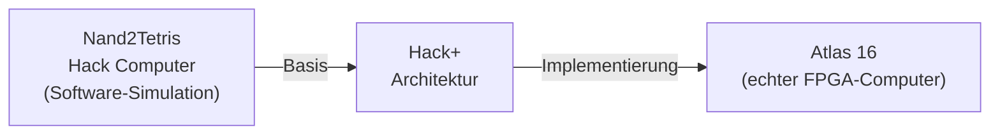

**Was sich ändert:**
- Hack läuft nicht mehr im Simulator, sondern auf echtem FPGA-Silizium
- Der Bildschirm hat 256 Farben statt 2
- Hardware-Sprites ermöglichen flüssige Spielgrafik
- Sounds werden über echte Audioausgabe ausgegeben
- MIDI-Unterstützung und PCM-Samples

**Was sich nicht ändert:**
- Die CPU ist identisch zum Original-Hack
- Originale Hack-Programme laufen unverändert (Kompatibilitätsmodus)
- Das Prinzip der Memory-Mapped IO bleibt erhalten
- Die Architektur bleibt verständlich und lehrreich

## 2.3 Lernziele dieses Buches

Nach dem Durcharbeiten dieses Buches wirst du:

1. Verstehen, wie ein FPGA funktioniert und was ihn von einem Mikroprozessor unterscheidet
2. Den Hack-Computer in SystemVerilog implementieren können
3. Verstehen, wie Grafikchips, Sound-Chips und Speicher-Controller intern arbeiten
4. Den Atlas 16 vollständig auf dem DE10-Nano zum Laufen bringen
5. Eigene Hack+-Programme schreiben, die die neue Hardware nutzen

---

# 3 Die Hack+-Architektur im Überblick

## 3.1 Gesamtarchitektur

Der Atlas 16 besteht aus zwei Teilen, die auf demselben Chip (DE10-Nano) leben:

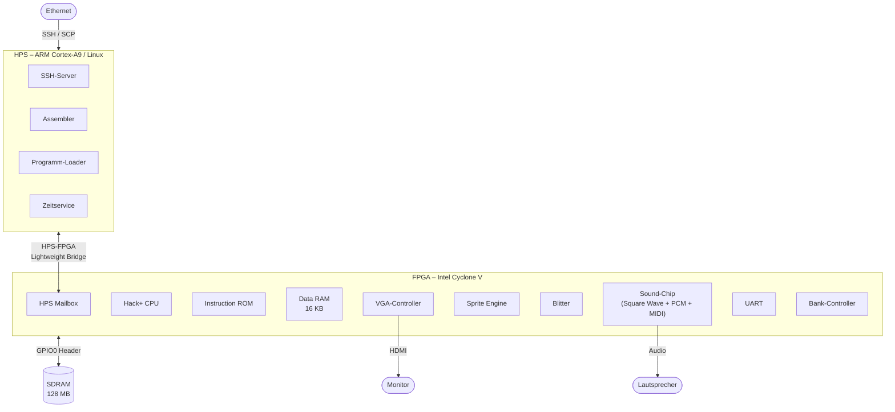

**HPS (Hard Processor System):** Der ARM-Prozessor auf dem Chip läuft
unter Linux und übernimmt "weiche" Aufgaben: Netzwerkzugang, Dateiablage,
Assemblierung von Programmen und das Laden in den FPGA.

**FPGA:** Hier lebt der eigentliche Atlas 16. Im Gegensatz zu einem
Mikroprozessor, der vorhandene Schaltungen ausführt, *ist* der FPGA die
Schaltung — jeder Chip, den wir beschreiben, wird buchstäblich in
Silizium-Logikzellen synthetisiert.

## 3.2 Harvard-Architektur

Wie der Original-Hack verwendet Atlas 16 eine **Harvard-Architektur**:
Instruktions- und Datenspeicher sind physisch getrennte Busse.

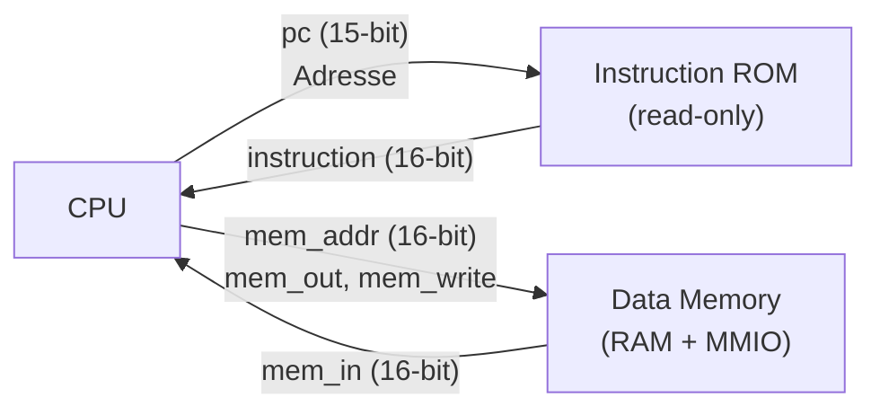

Der Vorteil: CPU kann in einem Taktzyklus gleichzeitig die nächste
Instruktion aus dem ROM lesen *und* auf den Datenspeicher zugreifen.
Dies erklärt die elegante Einfachheit der Hack-CPU.

Vergleiche: [N2T] Kapitel 5, Abschnitt 5.4 — *Perspective* erklärt,
warum Hack Harvard statt Von-Neumann verwendet.

## 3.3 Memory Map

Alle Peripheriegeräte des Atlas 16 sind über **Memory-Mapped IO** angebunden.
Das bedeutet: Die CPU "sieht" sie als ganz normale Speicheradressen.
Ein Schreiben auf Adresse `0x6300` sendet nicht Daten in den RAM,
sondern stellt die Frequenz des Sound-Chips ein.

Dieses Konzept wird in [N2T] Kapitel 5, Abschnitt 5.1.6 eingeführt.

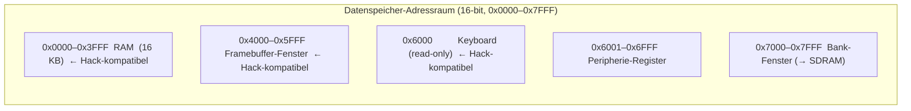

> **Warum nur bis 0x7FFF?**
> Die Hack A-Instruction kodiert einen 15-bit Wert (Bit 15 = 0).
> Das bedeutet, direkt adressierbar sind nur Werte 0–32767 = 0x0000–0x7FFF.
> Indem wir alle Peripherie unter dieser Grenze platzieren, brauchen wir
> die CPU nicht zu verändern. Originale Hack-Programme funktionieren weiterhin.

### Peripherie-Übersicht (0x6001–0x6FFF)

| Adresse       | Gerät                         |
|---------------|-------------------------------|
| 0x6001–0x600F | VGA-Control + Framebuffer-Ptr |
| 0x6100–0x617F | Sprite-Attribute (16 Sprites) |
| 0x6200–0x620A | Blitter                       |
| 0x6300–0x6331 | Sound + MIDI                  |
| 0x6400–0x6401 | UART                          |
| 0x6410–0x6415 | RTC                           |
| 0x6420–0x6423 | Timer                         |
| 0x6430        | Bank-Control                  |
| 0x6450–0x6457 | HPS Mailbox                   |

---

# 4 Was ist ein FPGA?

## 4.1 Von der programmierbaren Logik zum DE10-Nano

Die Geschichte des FPGA beginnt eigentlich vor dem FPGA. In den 1970er Jahren suchten Entwickler nach einer Möglichkeit, kundenspezifische Digitallogik schneller und billiger zu bauen als mit diskreten TTL-Bausteinen oder teuren Gate-Arrays. Ein wichtiger Zwischenschritt war das PAL (Programmable Array Logic), das 1978 von John Birkner und H. T. Chua bei Monolithic Memories eingeführt wurde: schnell, vergleichsweise günstig und gut für Prototypen, aber architektonisch noch eng begrenzt. Für größere Logik blieb in der Praxis meist nur der Weg über Gate-Arrays oder ASICs.

Der eigentliche FPGA-Gedanke wird heute klar Ross Freeman zugeschrieben. In seinem 1984 eingereichten und 1989 erteilten Patent beschrieb er einen Chip mit konfigurierbaren Logikelementen und konfigurierbaren Verbindungswegen — also genau den Kern dessen, was man heute unter einem FPGA versteht. Entscheidend war dabei nicht nur, dass einzelne Logikfunktionen gewählt werden konnten, sondern dass auch die Verschaltung auf dem Chip selbst per Konfigurationsdaten festgelegt wurde. Die National Inventors Hall of Fame führt Freeman deshalb ausdrücklich als Erfinder des FPGA.

Der erste kommerzielle Durchbruch kam 1985 mit dem Xilinx XC2064. Dieser Baustein besaß 64 konfigurierbare Logikblöcke und 58 I/O-Blöcke und wurde mit etwa 1.000 bis 1.500 Gate-Äquivalenten beworben. Seine Konfiguration lag in SRAM-Zellen auf dem Chip und konnte aus externer nichtflüchtiger Speicherung geladen werden. Damit war das Gerät nach dem Einschalten neu ladbar und später auch neu konfigurierbar — ein fundamentaler Unterschied zu fest verdrahteter Logik. Xilinx positionierte den XC2064 ausdrücklich als schnellere und deutlich flexiblere Alternative zu kundenspezifischen ASIC-Entwicklungen; der Chip kostete bei Marktstart etwa 55 bis 80 US-Dollar, das Entwicklungssystem allerdings noch 12.000 US-Dollar.

Schon kurz danach wurde klar, dass es nicht nur eine FPGA-Schule geben würde. Actel brachte 1988 mit der ACT-1-Familie eine Architektur auf Basis von Antifuse-Technologie auf den Markt. Diese Bausteine waren nicht beliebig neu ladbar wie SRAM-FPGAs, boten dafür aber nichtflüchtige Konfiguration und andere Eigenschaften, die für bestimmte Industrie- und sicherheitsnahe Anwendungen attraktiv waren. Historisch wichtig ist das deshalb, weil sich hier bereits die bis heute gültige Trennung zeigt: FPGA ist kein einzelner Schaltungstrick, sondern eine ganze Klasse rekonfigurierbarer Architekturen.

In den 1990er Jahren wuchs der FPGA von der flexiblen „Glue Logic" zu einer ernsthaften Systemplattform heran. Bei Xilinx markierte besonders die XC4000-Familie einen Wendepunkt: Sie bot On-Chip-RAM, breitere Decoderstrukturen und deutlich verbesserte Arithmetikpfade, etwa über schnelle Carry-Logik. Damit wurden FPGAs nicht mehr nur zum Ersetzen kleiner TTL- oder PAL-Schaltungen verwendet, sondern zunehmend für Zählerketten, Zustandsautomaten, Buslogik, kleine Prozessorstrukturen und erste signalverarbeitende Datenpfade. Parallel stieg die Kapazität stark an; Altera vermarktete die FLEX-10K-Familie 1997 bereits mit Dichten bis 130.000 Gates und ausdrücklich als „system-on-a-chip"-Lösung.

Der nächste große Schritt kam in den 2000er Jahren mit dem, was man rückblickend als Plattform-FPGA bezeichnen kann. Die Logikmatrix blieb zwar das Herzstück, aber hinzu kamen immer mehr spezialisierte Ressourcen: Block RAM, dedizierte Multiplikatoren, bessere Taktmanagement-Blöcke und später auch komplette Soft-Prozessoren wie MicroBlaze oder Nios. Gleichzeitig fielen die Einstiegskosten. Xilinx bewarb die Spartan-3-Familie mit bis zu 5 Millionen System Gates, bis zu 1,8 Mbit Block RAM, 18×18-Multiplikatoren und einem 99-Dollar-Starter-Kit. Spätestens hier wurde die FPGA-Technik nicht nur für Industriefirmen, sondern auch für Hochschulen, Labore und ambitionierte Einzelentwickler praktisch zugänglich.

Die Linie zum DE10-Nano führt dann über die SoC-FPGAs. Altera stellte 2011 die Cyclone-V-SoC-Familie vor: ein Baustein, der Dual-Core-ARM-Cortex-A9-Prozessoren, Speichercontroller, Peripherie und FPGA-Fabric in einem einzigen Chip vereint. Für die kostensensitive Cyclone-V-SoC-Klasse nannte Altera bis zu 110.000 Logic Elements und positionierte sie ausdrücklich für Anwendungen wie Industrieantriebe, Fahrerassistenz und eingebettete Bildverarbeitung. Parallel verschob sich damit die Rolle des FPGA: Er war nicht mehr nur rekonfigurierbare Logik neben einer CPU, sondern wurde selbst Teil eines hybriden Rechensystems aus festem Prozessor und frei formbarer Hardware.

Genau in diese Entwicklung gehört das DE10-Nano. Das Board verwendet ein Cyclone V SoC 5CSEBA6U23I7 mit 110K programmierbaren Logikelementen, Dual-Core ARM Cortex-A9, 1 GB DDR3, Gigabit Ethernet, microSD, USB und onboard USB-Blaster II. Terasic vermarktet es ausdrücklich als Development and Education Board. Historisch ist das bemerkenswert: Was 1985 noch ein relativ kleiner, teurer Spezialbaustein mit externer Entwicklungsumgebung war, erscheint hier als kompakte Lern- und Entwicklungsplattform, auf der man gleichzeitig digitale Schaltungen, Prozessoranbindung, Speicherzugriffe, Hardware/Software-Co-Design und sogar Linux auf dem Hard Processor System erlernen kann.

Für ein Buch über den Atlas 16 ist das DE10-Nano deshalb fast ideal: Es steht am Ende einer etwa dreißigjährigen Entwicklung, in der aus programmierbarer Ersatzlogik erst rekonfigurierbare Systemlogik, dann Plattformlogik und schließlich ein vollständiges SoC-FPGA-Lehrsystem wurde. Anders gesagt: Der Atlas 16 läuft auf dem DE10-Nano nicht nur zufällig gut — die Plattform ist das Ergebnis genau jener technischen Evolution, die Freemans ursprüngliche Idee möglich gemacht hat.

## 4.2 Von der Simulation zur echten Hardware

Im Nand2Tetris-Kurs hast du Schaltungen in **Hack HDL** beschrieben und
in einem Software-Simulator ausgeführt. Das war bequem zum Lernen, aber
die "Hardware" existierte nur virtuell im Arbeitsspeicher deines Computers.

Ein **FPGA** (Field-Programmable Gate Array) ist anders: Es ist ein echter
Chip aus echten Transistoren, der aber frei konfigurierbar ist.

## 4.3 Aufbau eines FPGA

Ein FPGA enthält:

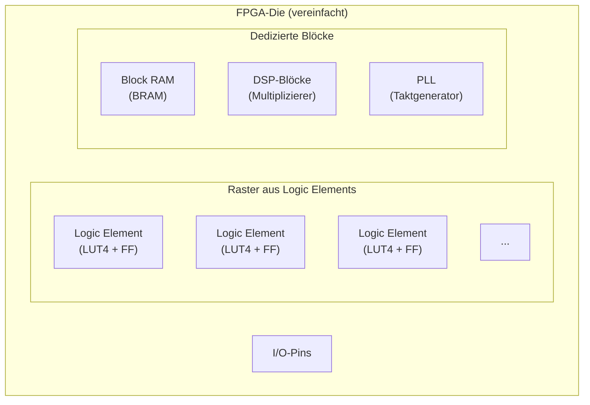

**Logic Element (LE):** Besteht aus einer *Look-Up-Table* (LUT) und einem
*Flip-Flop*. Eine LUT-4 kann jede beliebige Boolesche Funktion mit 4
Eingängen berechnen — also jeden Logikgatter-Typ, den du aus Nand2Tetris
kennst, und mehr.

**Block RAM (BRAM):** Eingebaute Speicherblöcke. Auf dem Cyclone V sind
das M10K-Blöcke à 10 Kbit. Wir verwenden sie für ROM und schnellen RAM.

**PLL (Phase-Locked Loop):** Erzeugt stabile Taktsignale beliebiger
Frequenz aus dem 50-MHz-Eingangsoszillator des DE10-Nano.

## 4.4 Wie kommt die Schaltung in den FPGA?

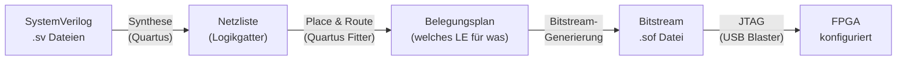

**Synthese:** Quartus übersetzt SystemVerilog in eine Netzliste aus
primitiven Logikgattern (AND, OR, NOT, Flip-Flops).

**Place & Route (Fitter):** Der Fitter weist jedem Gatter ein konkretes
Logic Element auf dem Chip zu und verbindet sie über das Routing-Netz.

**Bitstream:** Eine Binärdatei, die beschreibt, wie alle LUTs und
Verbindungen konfiguriert sind. Beim Einschalten oder auf Befehl wird
sie in den FPGA geladen.

## 4.5 Von Hack HDL über VHDL und Verilog zu SystemVerilog

Wer aus dem Nand2Tetris-Kurs kommt, kennt bereits eine Hardware Description Language — nämlich Hack HDL. Der Weg von dort zu SystemVerilog ist kürzer als er aussieht, wenn man versteht welche Probleme die einzelnen Sprachen jeweils gelöst haben.

### Hack HDL — das didaktische Minimum

Hack HDL wurde für den Nand2Tetris-Kurs entworfen: einfach, lesbar, ohne Mehrdeutigkeiten. Ein Chip ist eine Blackbox mit Eingängen, Ausgängen und einer Liste von Teilchips.

```
// Hack HDL: ein einfaches AND-Gatter
CHIP And {
    IN  a, b;
    OUT out;

    PARTS:
    Nand(a=a, b=b, out=nandOut);
    Nand(a=nandOut, b=nandOut, out=out);
}
```

Hack HDL beschreibt ausschließlich **kombinatorische Logik** durch Verdrahtung. Takt und Zustand existieren implizit nur im DFF-Primitiv. Das reicht für ein Lehrbuch — für echte Hardware nicht.

### VHDL — der europäische Weg (1987)

VHDL (VHSIC Hardware Description Language) entstand im Auftrag des US-Verteidigungsministeriums und wurde 1987 als IEEE-Standard verabschiedet. VHDL ist streng typisiert, verbose und hat klare Trennung zwischen Schnittstelle (`entity`) und Implementierung (`architecture`).

```vhdl
-- VHDL: dasselbe AND-Gatter
entity And_Gate is
    port (a : in  std_logic;
          b : in  std_logic;
          out : out std_logic);
end entity;

architecture rtl of And_Gate is
begin
    out <= a and b;
end architecture;
```

VHDL wird heute vor allem in Europa und in sicherheitskritischen Anwendungen (Luftfahrt, Rüstung) eingesetzt. Die Ausdrücklichkeit der Sprache ist Stärke und Schwäche zugleich.

### Verilog — der amerikanische Weg (1984/1995)

Verilog entstand 1984 bei Gateway Design Automation als interne Simulationssprache und wurde 1995 als IEEE 1364 standardisiert. Die Syntax ist C-ähnlich, kompakter als VHDL, aber mit Fallstricken: Der Unterschied zwischen `reg` und `wire` verwirrt Einsteiger bis heute, und `always @(*)` für kombinatorische Logik ist fehleranfällig.

```verilog
// Verilog: AND-Gatter und ein Register
module example (
    input  clk,
    input  a, b,
    output reg q
);
    wire and_out;
    assign and_out = a & b;        // kombinatorisch: wire + assign

    always @(posedge clk)          // sequentiell: reg + always
        q <= and_out;
endmodule
```

Verilog dominiert in den USA und in der Halbleiterindustrie. Viele Open-Source-FPGA-Tools (Yosys, nextpnr) verwenden es als primäre Eingabesprache.

### SystemVerilog — die Vereinigung (2005/2009/2012)

SystemVerilog (IEEE 1800) ist eine Obermenge von Verilog, die 2005 standardisiert wurde. Es beseitigt die wichtigsten Fallstricke und fügt für die Synthese entscheidende Verbesserungen hinzu:

- `logic` ersetzt `reg`/`wire` — ein Typ für alles
- `always_ff` und `always_comb` machen die Absicht explizit
- `typedef`, `enum`, `struct` für lesbareren Code
- Parameter mit Typen statt nackter Zahlen

```systemverilog
// SystemVerilog: dasselbe Beispiel, sauber
module example (
    input  logic clk,
    input  logic a, b,
    output logic q
);
    logic and_out;

    always_comb                    // Synthesizer weiß: das ist ein Gatter
        and_out = a & b;

    always_ff @(posedge clk)       // Synthesizer weiß: das ist ein Flip-Flop
        q <= and_out;
endmodule
```

### Der Vergleich: Hack HDL → SystemVerilog

Für Leser die aus Nand2Tetris kommen, ist die Übersetzung fast mechanisch:

| Hack HDL | SystemVerilog |
|---|---|
| `CHIP Name {` | `module Name (` |
| `IN a, b;` | `input logic a, b,` |
| `OUT out;` | `output logic out` |
| `PARTS:` | *(entfällt — direkte Beschreibung)* |
| `And(a=x, b=y, out=z);` | `assign z = x & y;` |
| `DFF(in=d, out=q);` | `always_ff @(posedge clk) q <= d;` |
| `Mux(a=x, b=y, sel=s, out=z);` | `assign z = s ? y : x;` |
| `}` | `endmodule` |

Der wichtigste konzeptionelle Unterschied: In Hack HDL gibt es keinen expliziten Takt — der DFF ist ein Primitiv das den Takt unsichtbar verwaltet. In SystemVerilog ist der Takt ein normales Signal, das du selbst verdrahtest. Das gibt dir mehr Kontrolle, verlangt aber auch mehr Verständnis dafür was im Chip tatsächlich passiert.

Dieses Buch verwendet ausschließlich **SystemVerilog IEEE 1800-2005** — die Version die von Quartus Prime Lite vollständig unterstützt wird und gleichzeitig auf allen gängigen Open-Source-Toolchains (Yosys, nextpnr) synthetisierbar ist.

## 4.6 Kombinatorische vs. sequentielle Logik in SystemVerilog

Diesen Unterschied kennst du aus [N2T] Kapitel 3 (Sequential Logic).
In SystemVerilog drücken wir ihn explizit aus:

```systemverilog
// Kombinatorische Logik: always_comb
// Verhält sich wie ein Gatter — reagiert sofort auf Eingaben
// Entspricht den "Part"-Chips in Hack HDL (NAND, AND, MUX, etc.)
always_comb begin
    y = a & b;   // AND-Gatter
end

// Sequentielle Logik: always_ff
// Speichert einen Wert — ändert sich NUR bei Taktflanke
// Entspricht dem DFF (Data Flip-Flop) aus Nand2Tetris Kapitel 4
always_ff @(posedge clk) begin
    if (rst)
        q <= 1'b0;     // synchroner Reset
    else
        q <= d;        // DFF: q(t) = d(t-1)
end
```

> **Wichtig:** In SystemVerilog-2005 wird der Unterschied durch
> `always_comb` und `always_ff` sichtbar gemacht — der Synthesizer
> weiß sofort, was ein Gatter und was ein Flip-Flop ist.
> Niemals `always @(*)` für kombinatorisch oder `always @(posedge clk)`
> für sequentiell ohne diese Keywords verwenden.

## 4.7 Das `logic`-Typ

Verilog kennt `reg` und `wire` — eine häufige Fehlerquelle.
SystemVerilog vereinfacht das:

```systemverilog
logic        single_bit;     // 1-bit Signal (reg oder wire, egal)
logic [15:0] data_bus;       // 16-bit Bus
logic [26:0] sdram_address;  // 27-bit SDRAM-Adresse
```

`logic` kann überall verwendet werden, wo früher `reg` oder `wire`
nötig war. Der Synthesizer entscheidet selbst.

---

# 5 Die Hack-CPU in SystemVerilog

## 5.1 Wiederholung: Was macht die Hack-CPU?

Die Hack-CPU kennst du aus [N2T] Kapitel 5 (Computer Architecture),
Abschnitt 5.2–5.3. Hier eine kurze Wiederholung.

Die Hack-CPU hat drei Register:

| Register | Bits | Funktion |
|----------|------|----------|
| A        | 16   | Adress- und Datenregister |
| D        | 16   | Datenregister |
| PC       | 15   | Programmzähler |

Sie versteht zwei Instruktionstypen, die du aus [N2T] Kapitel 4
(Machine Language) kennst:

### A-Instruction

```
Bit 15: 0 (Kennzeichen)
Bits 14–0: 15-bit Wert

Effekt: A ← Wert
```

Beispiel: `@42` → binär `000000000101010` → A = 42

### C-Instruction

```
Bits 15–13: 111 (Kennzeichen)
Bit 12:     a-Bit (0=A als ALU-Eingang, 1=Memory als ALU-Eingang)
Bits 11–6:  comp  (ALU-Funktion, 6 Bit)
Bits 5–3:   dest  (Zielregister: A, D, M)
Bits 2–0:   jump  (Sprungbedingung)

Effekt: dest = comp(D, A oder M)
        wenn Sprungbedingung zutrifft: PC ← A
```

Für eine vollständige Beschreibung der comp-, dest- und jump-Felder
→ [N2T] Kapitel 4, Abschnitt 4.2 (Hack Machine Language Specification).

## 5.2 Die ALU

Die ALU (Arithmetic Logic Unit) kennst du aus [N2T] Kapitel 2
(Boolean Arithmetic), Abschnitt 2.2–2.3.

Sie nimmt zwei 16-bit Operanden x und y sowie 6 Steuerbits
(zx, nx, zy, ny, f, no) und berechnet daraus eine Ausgabe:

| zx | nx | zy | ny | f | no | Funktion |
|----|----|----|----|---|----|----------|
|  1 |  0 |  1 |  0 | 1 |  0 | 0        |
|  1 |  1 |  1 |  1 | 1 |  1 | 1        |
|  1 |  1 |  1 |  0 | 1 |  0 | -1       |
|  0 |  0 |  1 |  1 | 0 |  0 | x        |
|  1 |  1 |  0 |  0 | 0 |  0 | y        |
|  0 |  0 |  1 |  1 | 0 |  1 | !x       |
|  0 |  1 |  1 |  1 | 1 |  1 | -x       |
|  0 |  1 |  1 |  1 | 1 |  0 | x-1      |
|  0 |  0 |  0 |  1 | 1 |  1 | x+y      |
|  0 |  1 |  0 |  0 | 1 |  1 | x-y      |
|  0 |  0 |  0 |  1 | 0 |  0 | x&y      |
|  0 |  1 |  0 |  1 | 0 |  1 | x\|y     |

→ Vollständige Tabelle in [N2T] Kapitel 2, Abschnitt 2.2.

### ALU-Datenfluss

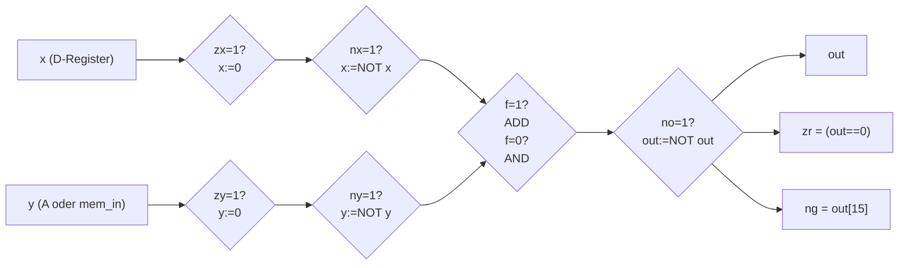

## 5.3 SystemVerilog-Implementierung

Jetzt übersetzen wir die Hack-CPU in echtes SystemVerilog.
Wir beginnen mit einem **Package** — einer Sammlung gemeinsamer
Typdefinitionen, die von allen CPU-Modulen geteilt werden.

### 5.3.1 Package: `hack_cpu_pkg`

```systemverilog
// hack_cpu.sv — Package-Deklaration
package hack_cpu_pkg;

    // ---------------------------------------------------------------
    // Instruktionstyp
    // In Hack ist Bit 15 der Instruktion das Unterscheidungsmerkmal:
    // Bit 15 = 0 → A-Instruction
    // Bit 15 = 1 → C-Instruction
    // Das 'enum' macht diesen Unterschied im Code explizit sichtbar.
    // ---------------------------------------------------------------
    typedef enum logic {
        A_INST = 1'b0,
        C_INST = 1'b1
    } inst_type_t;

    // ---------------------------------------------------------------
    // C-Instruction als Packed Struct
    // Ein 'struct packed' erlaubt uns, die 16-bit Instruktion in
    // ihre benannten Felder zu zerlegen — ohne manuelle Bit-Masken.
    // Vergleiche: [N2T] Kapitel 4, Abschnitt 4.2.3
    // ---------------------------------------------------------------
    typedef struct packed {
        logic        marker;  // Bit 15: immer 1 (C-Instruction)
        logic [1:0]  ones;    // Bits 14-13: immer 11
        logic        a_bit;   // Bit 12: 0=ALU liest A, 1=ALU liest M
        logic [5:0]  comp;    // Bits 11-6: ALU-Funktion (zx nx zy ny f no)
        logic [2:0]  dest;    // Bits 5-3: Ziel (A=Bit2, D=Bit1, M=Bit0)
        logic [2:0]  jump;    // Bits 2-0: Sprungbedingung
    } c_inst_t;

    // ---------------------------------------------------------------
    // Dest-Bits (Bit 5-3 der C-Instruction)
    // dest[2]=A, dest[1]=D, dest[0]=M
    // Mehrere können gleichzeitig gesetzt sein: z.B. dest=011 → D und M
    // ---------------------------------------------------------------
    localparam logic [2:0] DEST_NULL = 3'b000;
    localparam logic [2:0] DEST_M    = 3'b001;
    localparam logic [2:0] DEST_D    = 3'b010;
    localparam logic [2:0] DEST_MD   = 3'b011;
    localparam logic [2:0] DEST_A    = 3'b100;
    localparam logic [2:0] DEST_AM   = 3'b101;
    localparam logic [2:0] DEST_AD   = 3'b110;
    localparam logic [2:0] DEST_AMD  = 3'b111;

    // ---------------------------------------------------------------
    // Jump-Bits (Bits 2-0 der C-Instruction)
    // Sprung findet statt wenn: Bedingung UND inst_type==C_INST
    // ---------------------------------------------------------------
    localparam logic [2:0] JMP_NULL = 3'b000; // nie
    localparam logic [2:0] JMP_JGT  = 3'b001; // out > 0
    localparam logic [2:0] JMP_JEQ  = 3'b010; // out = 0
    localparam logic [2:0] JMP_JGE  = 3'b011; // out >= 0
    localparam logic [2:0] JMP_JLT  = 3'b100; // out < 0
    localparam logic [2:0] JMP_JNE  = 3'b101; // out != 0
    localparam logic [2:0] JMP_JLE  = 3'b110; // out <= 0
    localparam logic [2:0] JMP_JMP  = 3'b111; // immer

endpackage
```

### 5.3.2 Modul: `hack_alu`

Die ALU ist rein **kombinatorisch** — sie hat keinen Takt und kein
Gedächtnis. Für jeden Eingangsvektor liefert sie sofort (innerhalb
einer Gatterverzögerung) das Ergebnis.

```systemverilog
// ---------------------------------------------------------------
// hack_alu: Die Hack ALU
//
// Eingänge:
//   x    : erster Operand (D-Register)
//   y    : zweiter Operand (A-Register oder Memory)
//   comp : 6 Steuerbits [zx, nx, zy, ny, f, no]
//
// Ausgänge:
//   out  : Ergebnis der ALU-Operation
//   zr   : 1 wenn out == 0  ("zero flag")
//   ng   : 1 wenn out < 0   ("negative flag", = Bit 15)
//
// Referenz: [N2T] Kapitel 2, Abschnitt 2.2
// ---------------------------------------------------------------
module hack_alu (
    input  logic [15:0] x,
    input  logic [15:0] y,
    input  logic  [5:0] comp,
    output logic [15:0] out,
    output logic        zr,
    output logic        ng
);
    // Steuerbits benennen — lesbarer als comp[5], comp[4], ...
    logic zx, nx, zy, ny, f, no;
    assign {zx, nx, zy, ny, f, no} = comp;

    // ---------------------------------------------------------------
    // Stufe 1: x vorverarbeiten
    // zx=1: x wird auf 0 gesetzt (MUX: wähle 0 statt x)
    // nx=1: x wird bitweise negiert (NOT)
    // ---------------------------------------------------------------
    logic [15:0] x_after_zx;
    logic [15:0] x_after_nx;

    assign x_after_zx = zx ? 16'h0000 : x;
    assign x_after_nx = nx ? ~x_after_zx : x_after_zx;

    // ---------------------------------------------------------------
    // Stufe 2: y vorverarbeiten (identische Logik wie x)
    // ---------------------------------------------------------------
    logic [15:0] y_after_zy;
    logic [15:0] y_after_ny;

    assign y_after_zy = zy ? 16'h0000 : y;
    assign y_after_ny = ny ? ~y_after_zy : y_after_zy;

    // ---------------------------------------------------------------
    // Stufe 3: Funktion anwenden
    // f=0: bitweises AND
    // f=1: Addition (16-bit, der Überlauf wird ignoriert)
    // ---------------------------------------------------------------
    logic [15:0] func_out;
    assign func_out = f ? (x_after_nx + y_after_ny)
                       : (x_after_nx & y_after_ny);

    // ---------------------------------------------------------------
    // Stufe 4: Ausgabe nachverarbeiten
    // no=1: Ergebnis bitweise negieren
    // ---------------------------------------------------------------
    logic [15:0] pre_out;
    assign pre_out = no ? ~func_out : func_out;

    // ---------------------------------------------------------------
    // Ausgabe + Flags
    // ng: Bit 15 ist das Vorzeichen-Bit (Zweierkomplement)
    // zr: alle 16 Bits sind 0
    // ---------------------------------------------------------------
    assign out = pre_out;
    assign ng  = pre_out[15];
    assign zr  = (pre_out == 16'h0000);

endmodule
```

**Warum keine `always`-Blöcke?** Diese ALU verwendet ausschließlich
`assign`-Anweisungen. Das sind direkte Verbindungen — wie Drähte mit
eingebauten Gattern. In Hardware entspricht jede Zeile einem
Schaltkreis, der parallel und sofort reagiert.

### 5.3.3 Modul: `hack_cpu`

```systemverilog
// ---------------------------------------------------------------
// hack_cpu: Die vollständige Hack CPU
//
// Schnittstelle exakt nach [N2T] Kapitel 5, Abschnitt 5.2.4:
//
//   instruction : 16-bit Instruktionswort (vom Instruction ROM)
//   mem_in      : 16-bit Eingabe vom Datenspeicher (Memory[A])
//   reset       : synchroner Reset — setzt PC auf 0
//
//   mem_out     : Schreibwert für Datenspeicher
//   mem_addr    : Adresse des Datenspeichers (= Register A)
//   mem_write   : Schreibfreigabe (1 = schreiben)
//   pc          : Programmzähler (Adresse der nächsten Instruktion)
//
// Implementierungshinweis: [N2T] Kapitel 5, Abschnitt 5.3.2
// ---------------------------------------------------------------
module hack_cpu
    import hack_cpu_pkg::*;
(
    input  logic        clk,
    input  logic        rst,
    input  logic [15:0] instruction,
    input  logic [15:0] mem_in,
    output logic [15:0] mem_out,
    output logic [15:0] mem_addr,
    output logic        mem_write,
    output logic [14:0] pc
);

    // ---------------------------------------------------------------
    // Interne Register (flip-flop-basiert → always_ff)
    // A und D sind 16-bit breite Register — wie in [N2T] Kapitel 3
    // PC ist 15-bit (Hack hat max. 32K Instruktionen im ROM)
    // ---------------------------------------------------------------
    logic [15:0] reg_a;
    logic [15:0] reg_d;
    logic [14:0] reg_pc;

    // ---------------------------------------------------------------
    // Instruktion dekodieren
    // inst_type_t'(...) ist ein Type-Cast: wir interpretieren Bit 15
    // als den enum-Typ inst_type_t.
    // ---------------------------------------------------------------
    inst_type_t inst_type;
    assign inst_type = inst_type_t'(instruction[15]);

    // Das C-Instruction-Struct über die Instruktion legen
    c_inst_t c;
    assign c = c_inst_t'(instruction);

    // ---------------------------------------------------------------
    // ALU-Eingänge verdrahten
    //
    // x ist immer D-Register (der zweite Operand in Hack)
    //
    // y hängt vom a-Bit ab:
    //   a_bit = 0 → y = A-Register   (z.B. D+A, D&A)
    //   a_bit = 1 → y = Memory[A]    (z.B. D+M, D&M)
    //
    // Wichtig: comp-Bits werden nur bei C-Instructions ausgewertet.
    // Bei A-Instructions ist das comp-Feld bedeutungslos.
    // ---------------------------------------------------------------
    logic [15:0] alu_y;
    assign alu_y = (inst_type == C_INST && c.a_bit) ? mem_in : reg_a;

    logic [15:0] alu_out;
    logic        alu_zr, alu_ng;

    hack_alu alu_inst (
        .x    (reg_d),
        .y    (alu_y),
        .comp (c.comp),
        .out  (alu_out),
        .zr   (alu_zr),
        .ng   (alu_ng)
    );

    // ---------------------------------------------------------------
    // Datenspeicher-Schnittstelle
    //
    // mem_addr = A-Register: Die CPU gibt immer die aktuelle
    // Adresse aus — das Lesen ist kostenlos (kombinatorisch).
    //
    // mem_write: nur bei C-Instruction mit gesetztem dest[0] (M-Bit)
    // ---------------------------------------------------------------
    assign mem_addr  = reg_a;
    assign mem_out   = alu_out;
    assign mem_write = (inst_type == C_INST) && c.dest[0];

    // ---------------------------------------------------------------
    // Sprunglogik (kombinatorisch)
    //
    // Wir prüfen die jump-Bits gegen die ALU-Flags.
    // Ein Sprung findet statt, wenn:
    //   1. Wir eine C-Instruction ausführen (inst_type == C_INST)
    //   2. Die Bedingung erfüllt ist (do_jump == 1)
    //
    // Wenn gesprungen wird: PC ← A (Sprungziel steht immer in A)
    // ---------------------------------------------------------------
    logic do_jump;

    always_comb begin
        unique case (c.jump)
            JMP_NULL: do_jump = 1'b0;
            JMP_JGT:  do_jump = ~alu_ng & ~alu_zr;  // out > 0
            JMP_JEQ:  do_jump =  alu_zr;             // out = 0
            JMP_JGE:  do_jump = ~alu_ng;             // out >= 0
            JMP_JLT:  do_jump =  alu_ng;             // out < 0
            JMP_JNE:  do_jump = ~alu_zr;             // out != 0
            JMP_JLE:  do_jump =  alu_ng | alu_zr;   // out <= 0
            JMP_JMP:  do_jump = 1'b1;                // immer
        endcase
    end

    logic jump_taken;
    assign jump_taken = (inst_type == C_INST) && do_jump;

    // ---------------------------------------------------------------
    // Register-Updates — synchron zur steigenden Taktflanke
    //
    // Hier verwenden wir always_ff, weil das Flip-Flops sind.
    // In Hardware: Jedes Register ist ein D-Flip-Flop (DFF), wie in
    // [N2T] Kapitel 3 eingeführt.
    //
    // A-Register wird geladen bei:
    //   - A-Instruction: lade den 15-bit Wert der Instruktion
    //   - C-Instruction mit dest[2] gesetzt: lade ALU-Ausgabe
    //
    // D-Register wird geladen bei:
    //   - C-Instruction mit dest[1] gesetzt: lade ALU-Ausgabe
    //
    // PC wird geladen bei:
    //   - Sprung: PC ← A (Bits 14:0)
    //   - kein Sprung: PC ← PC + 1
    //   - Reset: PC ← 0
    // ---------------------------------------------------------------
    always_ff @(posedge clk) begin
        if (rst) begin
            reg_a  <= 16'h0000;
            reg_d  <= 16'h0000;
            reg_pc <= 15'h0000;
        end else begin
            // A-Register
            if (inst_type == A_INST)
                reg_a <= {1'b0, instruction[14:0]};
            else if (c.dest[2])
                reg_a <= alu_out;

            // D-Register
            if (inst_type == C_INST && c.dest[1])
                reg_d <= alu_out;

            // Program Counter
            if (jump_taken)
                reg_pc <= reg_a[14:0];
            else
                reg_pc <= reg_pc + 15'h0001;
        end
    end

    assign pc = reg_pc;

endmodule
```

## 5.4 Timing-Diagramm: Eine C-Instruction ausführen

Betrachten wir, was bei der Instruktion `D=D+A` passiert
(comp=`000010`, dest=`010`, jump=`000`, a_bit=`0`):

```
Takt:          __|‾‾|__|‾‾|__|‾‾|

instruction:   [  D=D+A  ][nächste]
               ──────────────────

(kombinatorisch, sofort):
alu_y:         [   reg_a  ]
alu_out:       [   D+A    ]
do_jump:       [   0      ]
mem_write:     [   0      ]

(bei steigender Flanke gespeichert):
reg_d:         [alt]──────[D+A]──
reg_pc:        [n] ────── [n+1]──
```

Die ALU rechnet **während des gesamten Taktzyklus** kombinatorisch.
Erst an der steigenden Taktflanke werden die Ergebnisse in die
Register übernommen. Dies entspricht genau dem Prinzip aus
[N2T] Kapitel 3, Abschnitt 3.1 (Time Matters).

## 5.5 Testbench

Siehe `Hardware/tb_hack_cpu.sv` — die Testbench simuliert 8 Test-
szenarien und überprüft automatisch die Ausgaben.

Ausführen in Quartus: `Simulation → Run Functional Simulation`

---

# 6 Speicher: RAM, ROM und SDRAM

## 6.1 Block RAM (BRAM) im FPGA

Der Intel Cyclone V enthält **M10K-Blöcke** — eingebaute Speicher-
module à 10.240 Bit. Sie sind schnell (1-Taktzyklus Zugriff), aber
begrenzt in der Größe. Wir nutzen sie für ROM und schnellen RAM.

### 6.1.1 Instruction ROM

```systemverilog
// ---------------------------------------------------------------
// hack_rom.sv — Instruction Memory (ROM)
//
// Speichert das Hack-Programm als 16-bit Worte.
// Wird beim Start vom HPS via Bridge befüllt.
//
// In der FPGA-Synthese wird ein M10K Block RAM verwendet.
// ROM_DEPTH = 32768 → 32K × 16-bit = 64 KB für Instruktionen.
// ---------------------------------------------------------------
module hack_rom #(
    parameter int ROM_DEPTH = 32768
) (
    input  logic        clk,
    // Leseport (von der CPU)
    input  logic [14:0] pc,
    output logic [15:0] instruction,
    // Schreibport (vom HPS-Loader)
    input  logic [14:0] wr_addr,
    input  logic [15:0] wr_data,
    input  logic        wr_en
);
    // M10K inferieren: einfaches 2-Port-RAM
    // Port A: Lesen (CPU), Port B: Schreiben (HPS-Loader)
    logic [15:0] rom_mem [0:ROM_DEPTH-1];

    // Synchrones Lesen — 1 Taktzyklus Latenz
    always_ff @(posedge clk) begin
        instruction <= rom_mem[pc];
    end

    // Synchrones Schreiben (nur durch HPS-Loader beim Programmieren)
    always_ff @(posedge clk) begin
        if (wr_en)
            rom_mem[wr_addr] <= wr_data;
    end

endmodule
```

### 6.1.2 Data RAM

```systemverilog
// =============================================================================
// hack_ram.sv — Datenspeicher des Atlas 16
//
// Adressraum:
//   0x0000–0x3FFF  RAM (16 KB, Hack-kompatibel, entspricht [N2T] Kap. 5.2.3)
//   0x4000–0x5FFF  Framebuffer-Fenster (Schreibzugriffe → VGA-Controller)
//   0x6000         Keyboard (read-only, Hack-kompatibel)
//   0x6001–0x7FFF  Peripherie-Register (→ Peripherie-Decoder im Toplevel)
// =============================================================================
module hack_ram (
    input  logic        clk,
    input  logic        rst,
    input  logic [15:0] address,
    input  logic [15:0] data_in,
    input  logic        write_en,
    output logic [15:0] data_out,
    // Hack-kompatibler Keyboard-Eingang (0x6000)
    input  logic [15:0] keyboard_in,
    // Framebuffer-Fenster-Interface (0x4000–0x5FFF → VGA)
    output logic [12:0] fb_addr,
    output logic [15:0] fb_data,
    output logic        fb_write,
    // Peripherie-Bus-Interface (0x6001–0x7FFF)
    output logic [15:0] per_addr,
    output logic [15:0] per_data,
    output logic        per_write,
    input  logic [15:0] per_read
);
    localparam int RAM_SIZE = 16384;
    localparam logic [15:0] RAM_END  = 16'h3FFF;
    localparam logic [15:0] FB_START = 16'h4000;
    localparam logic [15:0] FB_END   = 16'h5FFF;
    localparam logic [15:0] KBD_ADDR = 16'h6000;
    localparam logic [15:0] PER_END  = 16'h7FFF;

    logic [15:0] ram [0:RAM_SIZE-1];

    // Synchrones Schreiben in den RAM-Bereich
    always_ff @(posedge clk) begin
        if (write_en && address <= RAM_END)
            ram[address[13:0]] <= data_in;
    end

    // Framebuffer-Fenster: Schreibzugriffe weiterleiten
    assign fb_addr  = address[12:0];
    assign fb_data  = data_in;
    assign fb_write = write_en && (address >= FB_START) && (address <= FB_END);

    // Peripherie-Bus: Zugriffe auf 0x6001–0x7FFF weiterleiten
    assign per_addr  = address;
    assign per_data  = data_in;
    assign per_write = write_en && (address > KBD_ADDR) && (address <= PER_END);

    // Lesemultiplexer
    always_comb begin
        if (address <= RAM_END)
            data_out = ram[address[13:0]];
        else if (address >= FB_START && address <= FB_END)
            data_out = 16'h0000;    // Framebuffer: write-only für CPU
        else if (address == KBD_ADDR)
            data_out = keyboard_in;
        else if (address <= PER_END)
            data_out = per_read;    // Peripherie-Decoder liefert Wert
        else
            data_out = 16'hDEAD;
    end

endmodule
```

## 6.2 SDRAM: Externer Hauptspeicher

128 MB sind zu groß für BRAM — dafür brauchen wir den externen
SDRAM-Chip auf dem MiSTer-Erweiterungsboard.

### 6.2.1 Was ist SDRAM?

SDRAM (Synchronous Dynamic RAM) ist fundamentell anders als das
statische BRAM:

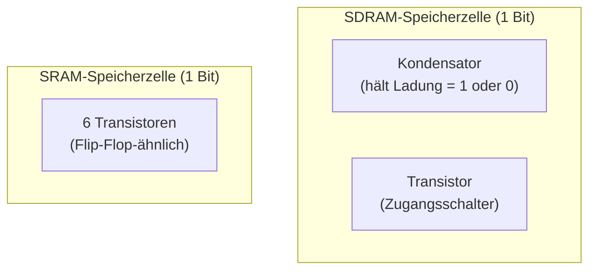

**SDRAM:** Eine Speicherzelle = 1 Transistor + 1 Kondensator.
Sehr kompakt → viel Speicher auf kleiner Fläche → 128 MB möglich.

**Nachteil:** Der Kondensator entlädt sich langsam → muss alle paar
Millisekunden **aufgefrischt** (refreshed) werden. Das SDRAM-Interface
ist daher deutlich komplexer als einfaches BRAM.

### 6.2.2 SDRAM-Zugriff: Aktivieren, Lesen/Schreiben, Voraufladen

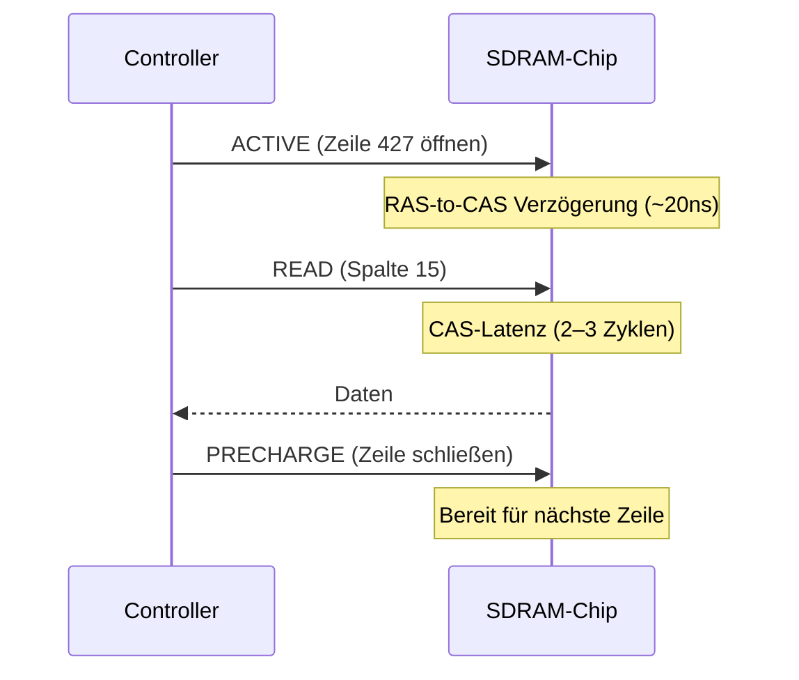

Der **MiSTer SDRAM-Controller** (basierend auf dem Gameboy-Core)
kapselt diese Komplexität. Wir verwenden ihn direkt.

### 6.2.3 SDRAM-Controller (MiSTer-Basis)

Der Controller bietet ein einfaches 3-Kanal-Interface:

```systemverilog
// ---------------------------------------------------------------
// sdram_ctrl.sv — Vereinfachtes Interface zum MiSTer SDRAM
//
// Chip: AS4C32M16SB (32M × 16-bit, 64 MB pro Chip)
// Zwei Chips parallel → 128 MB gesamt, 32-bit Datenbus
//
// Drei unabhängige Kanäle mit Priorität: ch0 > ch1 > ch2
//   ch0: CPU/Blitter (höchste Priorität)
//   ch1: VGA-DMA (muss pünktlich Pixel liefern)
//   ch2: Sprite-Engine (niedrigste Priorität)
// ---------------------------------------------------------------
module sdram_ctrl (
    input  logic        clk,        // SDRAM-Takt (≤128 MHz)
    input  logic        rst,
    // SDRAM-Pins (→ GPIO0 Header des DE10-Nano)
    output logic [12:0] sdram_a,    // Adress-Bus
    inout  logic [15:0] sdram_dq,   // Daten-Bus (bidirektional)
    output logic  [1:0] sdram_ba,   // Bank-Auswahl
    output logic        sdram_cas_n,
    output logic        sdram_ras_n,
    output logic        sdram_we_n,
    output logic        sdram_cs_n,
    output logic        sdram_cke,
    output logic        sdram_clk,
    output logic  [1:0] sdram_dqm,
    // Kanal 0: CPU / Blitter
    input  logic [26:0] ch0_addr,
    input  logic [15:0] ch0_din,
    input  logic        ch0_we,
    input  logic        ch0_req,
    output logic [15:0] ch0_dout,
    output logic        ch0_ack,
    // Kanal 1: VGA-DMA
    input  logic [26:0] ch1_addr,
    input  logic        ch1_req,
    output logic [15:0] ch1_dout,
    output logic        ch1_ack,
    // Kanal 2: Sprite-Engine
    input  logic [26:0] ch2_addr,
    input  logic        ch2_req,
    output logic [15:0] ch2_dout,
    output logic        ch2_ack
);
    // Implementierung: State Machine mit INIT, REFRESH, IDLE,
    // ACTIVE, READ, WRITE, PRECHARGE Zuständen.
    // Details: siehe Hardware/sdram_ctrl.sv (vollständige Version)
endmodule
```

### 6.2.4 Bank Switching

Mit dem Bank-Controller kann die CPU auf beliebige Teile des
SDRAM zugreifen, obwohl ihr Adressraum nur 64 KB groß ist:

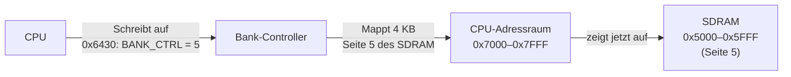

Das Bank-Fenster liegt bei `0x7000–0x7FFF` (4 KB).
Mit einem 8-bit Bank-Register (Bit 7 = Schreibschutz) können
128 × 4 KB = 512 KB direkt von der CPU adressiert werden.
Der Rest (via Blitter-DMA) deckt alle 128 MB ab.

---

# 7 VGA- und HDMI-Ausgabe

## 7.1 Grundlagen: Wie funktioniert ein Bildschirm?

Ein Bildschirm zeigt Bilder durch **Zeilenweise Abtastung**:
Der Elektronenstrahl (CRT) oder die Pixelsteuerung (LCD/HDMI) fährt
jede Zeile von links nach rechts ab, dann zur nächsten Zeile.

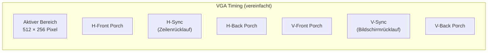

**HSYNC-Puls:** Signalisiert dem Monitor: "neue Zeile beginnt"
**VSYNC-Puls:** Signalisiert: "neues Bild beginnt"

Der DE10-Nano hat einen HDMI-Anschluss (ADV7513-Chip). Wir erzeugen
parallele RGB-Daten + Sync-Signale und übergeben sie an den ADV7513.

## 7.2 Framebuffer und Double Buffering

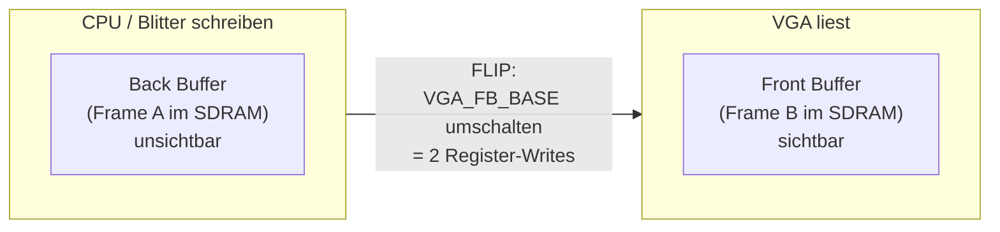

**Ohne Double Buffering:** Zeichnet die CPU während der VGA-Darstellung,
sieht der Benutzer halbfertige Frames ("Tearing").

**Mit Double Buffering:** CPU zeichnet immer in den unsichtbaren
Back Buffer. Erst wenn ein Frame fertig ist, wird mit zwei
Register-Schreibvorgängen umgeschaltet. Der VGA-Controller beginnt
dann beim nächsten VSYNC mit dem neuen Buffer. Kein Tearing.

## 7.3 Kompatibilitätsmodus (VGA_MODE = 0)

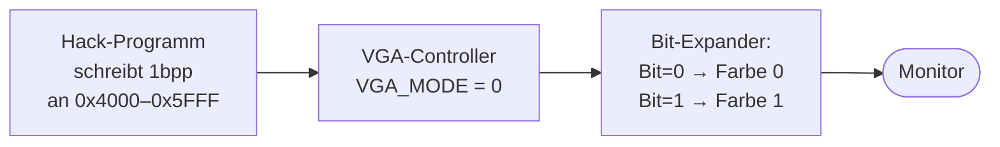

Im Legacy-Modus interpretiert der Controller die 8.192 Worte bei
`0x4000–0x5FFF` als 1-Bit-pro-Pixel-Daten (16 Pixel pro 16-bit-Wort).
Das entspricht exakt dem Hack-Bildschirm aus [N2T] Kapitel 5, Abschn. 5.2.

Im Atlas-16-Modus (`VGA_MODE = 1`) sind `0x4000–0xBFFF` ein 8bpp-
Framebuffer (1 Byte = 1 Pixel, 256 Farben aus 24-bit Palette).

## 7.4 VGA-Control-Register (0x6001–0x600F)

| Adresse | Register       | Beschreibung                          |
|---------|----------------|---------------------------------------|
| 0x6001  | VGA_MODE       | 0 = Legacy 1bpp,  1 = Color 8bpp      |
| 0x6002  | VGA_FB_BASE_LO | Framebuffer SDRAM-Adresse (low 16-bit) |
| 0x6003  | VGA_FB_BASE_HI | Framebuffer SDRAM-Adresse (high 11-bit)|
| 0x6004  | PALETTE_0      | Farbe für Bit=0 (Legacy)              |
| 0x6005  | PALETTE_1      | Farbe für Bit=1 (Legacy)              |
| 0x6006  | BORDER_COLOR   | Randfarbe                             |

## 7.5 SystemVerilog: vga_controller.sv

Der vollständige VGA-Controller implementiert beide Modi, den SDRAM-DMA-Prefetch
und ab Kapitel 8 auch das Sprite-Compositing-Interface.

```systemverilog
// =============================================================================
// vga_controller.sv — VGA/HDMI-Controller für den Atlas 16
//
// Erzeugt ein 512×256 Pixel Bild mit zwei Modi:
//   VGA_MODE = 0  Legacy Hack:  1bpp, 512×256, 2 Farben aus Palette
//   VGA_MODE = 1  Atlas 16:     8bpp, 512×256, 256 Farben (RGB 3-3-2)
//
// Timing: 640×480 @ 60 Hz (Standard VGA), Pixeltakt 25,175 MHz
// Das 512×256 Bild wird im 640×480-Rahmen zentriert dargestellt.
// SDRAM-Kanal 1: DMA liest Framebuffer (kein CPU-Aufwand)
// =============================================================================
module vga_controller (
    input  logic        clk_25mhz,
    input  logic        rst,
    // Konfiguration
    input  logic        vga_mode,       // 0=1bpp Legacy, 1=8bpp Color
    input  logic [26:0] fb_base,        // SDRAM Framebuffer-Basisadresse
    input  logic  [7:0] palette_0,      // Legacy-Modus: Farbe für Bit=0
    input  logic  [7:0] palette_1,      // Legacy-Modus: Farbe für Bit=1
    // SDRAM-DMA-Interface (Kanal 1, read-only)
    output logic [26:0] sdram_addr,
    input  logic [15:0] sdram_data,
    output logic        sdram_req,
    input  logic        sdram_ack,
    // HDMI/VGA-Ausgabe (an ADV7513)
    output logic        hsync,
    output logic        vsync,
    output logic        de,
    output logic  [7:0] r, g, b,
    // Timing-Ausgaben (für Sprite Engine)
    output logic  [9:0] hcount,
    output logic  [9:0] vcount,
    // Sprite-Compositor-Eingang (von sprite_engine)
    input  logic  [7:0] sprite_pixel,
    input  logic        sprite_valid
);
    // VGA 640×480 @ 60 Hz Timing-Parameter
    localparam int H_ACTIVE = 640, H_FP = 16, H_SYNC = 96, H_BP = 48;
    localparam int H_TOTAL  = H_ACTIVE + H_FP + H_SYNC + H_BP; // 800
    localparam int V_ACTIVE = 480, V_FP = 10, V_SYNC = 2,  V_BP = 33;
    localparam int V_TOTAL  = V_ACTIVE + V_FP + V_SYNC + V_BP; // 525
    // 512×256 Bild zentriert im 640×480 Rahmen
    localparam int IMG_W    = 512, IMG_H = 256;
    localparam int IMG_X_OFF = (H_ACTIVE - IMG_W) / 2;   // 64
    localparam int IMG_Y_OFF = (V_ACTIVE - IMG_H) / 2;   // 112

    // Horizontaler und vertikaler Zähler
    logic [9:0] h_cnt, v_cnt;
    assign hcount = h_cnt;
    assign vcount = v_cnt;

    always_ff @(posedge clk_25mhz) begin
        if (rst) begin
            h_cnt <= '0;
            v_cnt <= '0;
        end else begin
            if (h_cnt == H_TOTAL - 1) begin
                h_cnt <= '0;
                v_cnt <= (v_cnt == V_TOTAL - 1) ? '0 : v_cnt + 1;
            end else
                h_cnt <= h_cnt + 1;
        end
    end

    // Sync-Signale (aktiv-niedrig bei Standard-VGA)
    always_ff @(posedge clk_25mhz) begin
        hsync <= ~(h_cnt >= (H_ACTIVE + H_FP) &&
                   h_cnt <  (H_ACTIVE + H_FP + H_SYNC));
        vsync <= ~(v_cnt >= (V_ACTIVE + V_FP) &&
                   v_cnt <  (V_ACTIVE + V_FP + V_SYNC));
    end

    // Aktiver Bereich und Bildkoordinaten
    logic h_active, v_active, pixel_active, in_image;
    logic [8:0] img_x;
    logic [7:0] img_y;

    assign h_active    = (h_cnt < H_ACTIVE);
    assign v_active    = (v_cnt < V_ACTIVE);
    assign pixel_active = h_active && v_active;
    assign in_image    = (h_cnt >= IMG_X_OFF && h_cnt < IMG_X_OFF + IMG_W) &&
                         (v_cnt >= IMG_Y_OFF && v_cnt < IMG_Y_OFF + IMG_H);
    assign img_x       = h_cnt[8:0] - IMG_X_OFF[8:0];
    assign img_y       = v_cnt[7:0] - IMG_Y_OFF[7:0];
    assign de          = pixel_active;

    // SDRAM-Prefetch und Pixel-Schieberegister
    logic [15:0] pixel_shift_reg;
    logic  [3:0] shift_cnt;
    logic [26:0] read_addr;
    logic  [7:0] pixel_color;

    always_ff @(posedge clk_25mhz) begin
        if (rst) begin
            shift_cnt <= '0;
            read_addr <= fb_base;
            sdram_req <= 1'b0;
        end else begin
            if (v_cnt == 0 && h_cnt == 0)
                read_addr <= fb_base;
            if (in_image) begin
                if (shift_cnt == 0) begin
                    sdram_req <= 1'b1;
                    if (sdram_ack) begin
                        pixel_shift_reg <= sdram_data;
                        read_addr       <= read_addr + 1;
                        sdram_req       <= 1'b0;
                        shift_cnt       <= vga_mode ? 4'd2 : 4'd16;
                    end
                end else begin
                    if (vga_mode) begin
                        pixel_color     <= pixel_shift_reg[7:0];
                        pixel_shift_reg <= {8'h00, pixel_shift_reg[15:8]};
                    end else begin
                        pixel_color     <= pixel_shift_reg[0] ? palette_1 : palette_0;
                        pixel_shift_reg <= {1'b0, pixel_shift_reg[15:1]};
                    end
                    shift_cnt <= shift_cnt - 1;
                end
            end else
                sdram_req <= 1'b0;
        end
    end

    assign sdram_addr = read_addr;

    // Sprite-Compositing und Farb-Dekodierung
    // Sprite hat Vorrang vor Hintergrund wenn sprite_valid = 1
    logic [7:0] final_color;
    assign final_color = (in_image && sprite_valid) ? sprite_pixel : pixel_color;

    // RGB 3-3-2 → 8-8-8 (Bit-Replikation für HDMI)
    always_ff @(posedge clk_25mhz) begin
        if (!pixel_active || !in_image) begin
            r <= 8'h00; g <= 8'h00; b <= 8'h00;
        end else begin
            r <= {final_color[7:5], final_color[7:5], final_color[7:6]};
            g <= {final_color[4:2], final_color[4:2], final_color[4:3]};
            b <= {final_color[1:0], final_color[1:0], final_color[1:0],
                  final_color[1:0]};
        end
    end

endmodule
```

---

# 8 Grafik-Coprozessor: Sprite Engine + Blitter

## 8.1 Was sind Hardware-Sprites?

In frühen Spielen mussten Spielfiguren (Sprites) manuell in den
Framebuffer gezeichnet werden — eine CPU-intensive Aufgabe. Moderne
(und retro!) Grafik-Chips lösen das mit Hardware-Sprites:

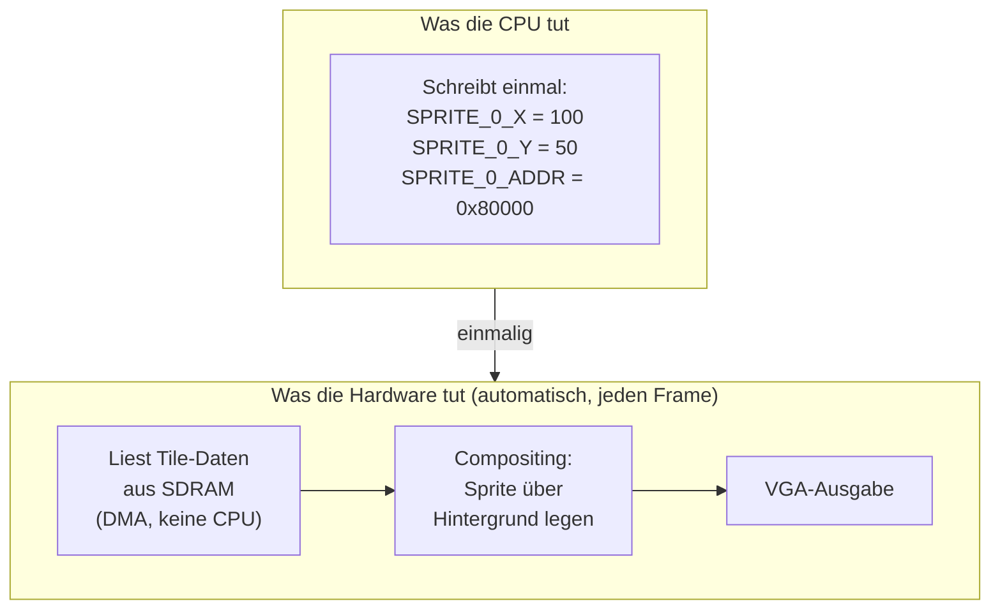

**Ergebnis:** Die CPU schreibt nur Position + Tile-Adresse in Register.
Die Hardware kümmert sich um alles andere — 0 CPU-Zyklen pro Frame.

## 8.2 Sprite-Parameter

Jeder der 16 Sprites hat folgende Eigenschaften:

| Parameter    | Bits | Beschreibung                            |
|--------------|------|-----------------------------------------|
| X-Position   | 9    | 0–511 (passt zur 512-Pixel-Breite)      |
| Y-Position   | 8    | 0–255 (passt zur 256-Pixel-Höhe)        |
| Tile-Adresse | 27   | SDRAM-Zeiger (zwei 16-bit Register)     |
| Color-Key    | 8    | Dieser Farbindex = transparent          |
| Flags        | 4    | aktiv, flip_x, flip_y, Priorität        |

Sprite-Größe: **16×16 Pixel × 8bpp = 256 Byte pro Tile**

### Sprite-Attribut-Register (0x6100–0x617F)

```
Sprite 0: Basisadresse 0x6100
  0x6100  SPRITE_0_X      (9-bit X-Position)
  0x6101  SPRITE_0_Y      (8-bit Y-Position)
  0x6102  SPRITE_0_ADDR_LO (Tile-Adresse, Bits 15-0)
  0x6103  SPRITE_0_ADDR_HI (Tile-Adresse, Bits 26-16)
  0x6104  SPRITE_0_FLAGS  (Bit 0: aktiv, 1: flip_x, 2: flip_y, 3: prior.)
  0x6105  SPRITE_0_CKEY   (Transparenzfarbe)
  0x6106  reserviert
  0x6107  reserviert

Sprite 1: Basisadresse 0x6108  (je +8)
...
Sprite 15: Basisadresse 0x6178
```

## 8.3 Priorität und Compositing

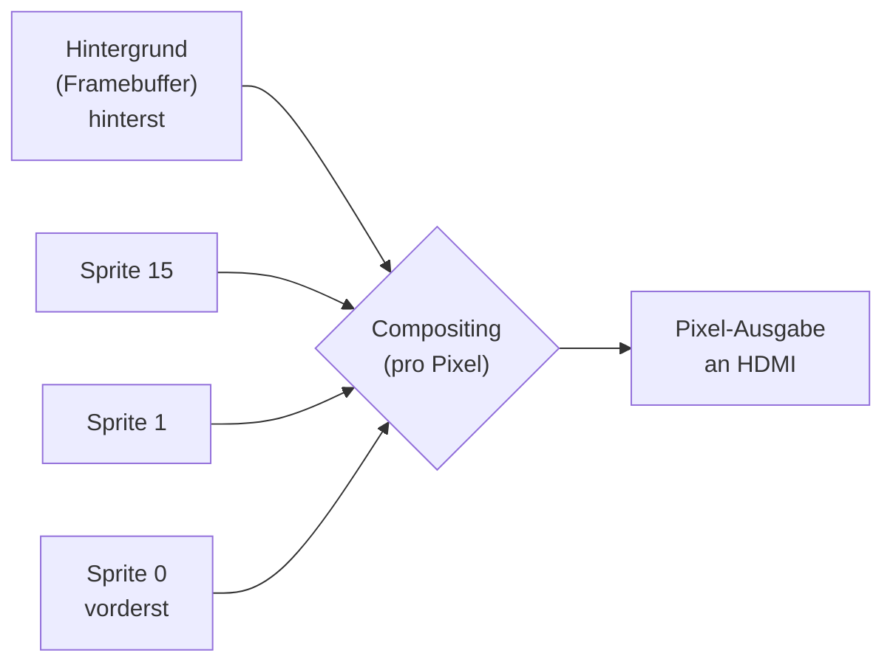

Pro Pixel entscheidet die Hardware: Ist Sprite 0 aktiv und der Pixel
nicht transparent (Color-Key)? → Sprite 0. Sonst Sprite 1, etc.

## 8.4 Der Blitter

Der Blitter (Block Image Transferer) beschleunigt Rechteck-Operationen
im Framebuffer asynchron — die CPU startet eine Operation und macht
sofort weiter.

### State Machine

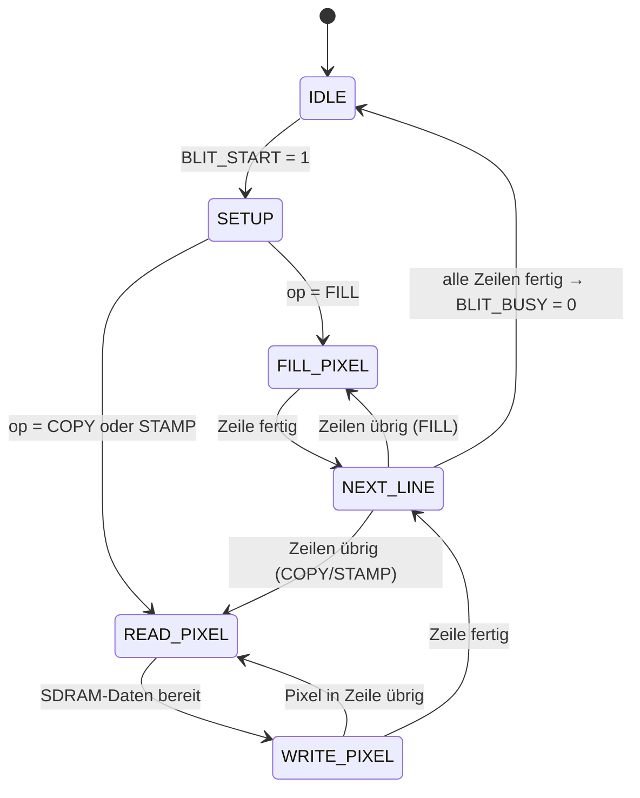

### Blitter-Register (0x6200–0x620A)

| Adresse | Register      | Beschreibung                            |
|---------|---------------|-----------------------------------------|
| 0x6200  | BLIT_SRC_LO   | Quell-Adresse SDRAM (Bits 15-0)         |
| 0x6201  | BLIT_SRC_HI   | Quell-Adresse SDRAM (Bits 26-16)        |
| 0x6202  | BLIT_DST_LO   | Ziel-Adresse SDRAM (Bits 15-0)          |
| 0x6203  | BLIT_DST_HI   | Ziel-Adresse SDRAM (Bits 26-16)         |
| 0x6204  | BLIT_WIDTH    | Breite in Pixeln (1–512)                |
| 0x6205  | BLIT_HEIGHT   | Höhe in Zeilen (1–256)                  |
| 0x6206  | BLIT_COLOR    | Füllfarbe (FILL-Operation)              |
| 0x6207  | BLIT_COLORKEY | Transparenzfarbe (STAMP-Operation)      |
| 0x6208  | BLIT_OP       | 0=COPY,  1=FILL,  2=STAMP               |
| 0x6209  | BLIT_START    | Schreibe 1 → startet Operation          |
| 0x620A  | BLIT_BUSY     | 1=läuft,  0=fertig (nur lesen)         |

### 8.4.1 SystemVerilog: blitter.sv

Der Blitter besitzt ein vollständiges CPU-Register-Interface und eine
State Machine, die je nach Opcode verschiedene SDRAM-Zugriffsmuster ausführt.
FILL braucht nur Schreibzugriffe, COPY benötigt je einen Lese- und Schreibzugriff
pro Wort, STAMP führt eine Read-Modify-Write-Operation durch (Colorkey-Transparenz).

```systemverilog
// =============================================================================
// blitter.sv — Asynchroner DMA-Blitter für Atlas 16
//
// COPY  (op=0): Rechteck von SRC nach DST kopieren
// FILL  (op=1): Rechteck mit BLIT_COLOR füllen (kein Lesezugriff)
// STAMP (op=2): Wie COPY, aber Colorkey-Pixel werden durch Ziel ersetzt
//
// SDRAM-Adressierung: 27-bit Wortadressen (16-bit Breite = 2 Pixel/Wort)
// Framebuffer-Zeilenbreite: 256 Worte = 512 Pixel @ 8bpp
// =============================================================================
module blitter (
    input  logic        clk,
    input  logic        rst,
    // CPU-Register-Interface
    input  logic  [3:0] reg_addr,
    input  logic [15:0] reg_wdata,
    input  logic        reg_write,
    output logic [15:0] reg_rdata,
    // SDRAM-Interface (Kanal 0)
    output logic [26:0] sdram_addr,
    output logic        sdram_we,
    output logic [15:0] sdram_wdata,
    input  logic [15:0] sdram_rdata,
    output logic        sdram_req,
    input  logic        sdram_ack
);
    localparam logic [1:0] OP_COPY  = 2'd0;
    localparam logic [1:0] OP_FILL  = 2'd1;
    localparam logic [1:0] OP_STAMP = 2'd2;
    localparam int FB_ROW_WORDS = 256; // 512 Pixel / 2 Pixel pro Wort

    // Konfigurationsregister
    logic [26:0] src_addr, dst_addr;
    logic  [9:0] width_px;
    logic  [7:0] height, fill_color, colorkey;
    logic  [1:0] op;
    logic        busy;
    logic  [8:0] width_words; // ceil(width_px / 2)
    assign width_words = width_px[0] ? (width_px[9:1] + 1'b1) : width_px[9:1];

    always_ff @(posedge clk) begin
        if (rst) begin
            src_addr <= 27'h0; dst_addr <= 27'h0;
            width_px <= 10'd512; height <= 8'd256;
            fill_color <= 8'h00; colorkey <= 8'h00;
            op <= OP_COPY;
        end else if (reg_write && !busy) begin
            unique case (reg_addr)
                4'h0: src_addr[15:0]  <= reg_wdata;
                4'h1: src_addr[26:16] <= reg_wdata[10:0];
                4'h2: dst_addr[15:0]  <= reg_wdata;
                4'h3: dst_addr[26:16] <= reg_wdata[10:0];
                4'h4: width_px        <= reg_wdata[9:0];
                4'h5: height          <= reg_wdata[7:0];
                4'h6: fill_color      <= reg_wdata[7:0];
                4'h7: colorkey        <= reg_wdata[7:0];
                4'h8: op              <= reg_wdata[1:0];
                default: ;
            endcase
        end
    end

    always_comb begin
        unique case (reg_addr)
            4'h0: reg_rdata = src_addr[15:0];
            4'h1: reg_rdata = {5'h0, src_addr[26:16]};
            4'h2: reg_rdata = dst_addr[15:0];
            4'h3: reg_rdata = {5'h0, dst_addr[26:16]};
            4'h4: reg_rdata = {6'h0, width_px};
            4'h5: reg_rdata = {8'h0, height};
            4'h6: reg_rdata = {8'h0, fill_color};
            4'h7: reg_rdata = {8'h0, colorkey};
            4'h8: reg_rdata = {14'h0, op};
            4'h9: reg_rdata = 16'h0000;
            4'ha: reg_rdata = {15'h0, busy};
            default: reg_rdata = 16'h0000;
        endcase
    end

    // State Machine
    typedef enum logic [2:0] {
        ST_IDLE, ST_FILL_REQ, ST_FILL_WAIT,
        ST_COPY_RD_REQ, ST_COPY_RD_WAIT,
        ST_COPY_WR_REQ, ST_COPY_WR_WAIT,
        ST_NEXT
    } blit_state_t;

    blit_state_t   state;
    logic [26:0]   cur_src, cur_dst;
    logic  [8:0]   col_cnt;
    logic  [7:0]   row_cnt;
    logic [15:0]   rd_buf;
    logic [26:0]   stamp_dst_save;
    logic [15:0]   stamp_dst_buf;

    // STAMP: Colorkey-Pixel durch Ziel ersetzen
    logic [7:0] stamp_lo, stamp_hi;
    assign stamp_lo = (rd_buf[7:0]  == colorkey) ? stamp_dst_buf[7:0]  : rd_buf[7:0];
    assign stamp_hi = (rd_buf[15:8] == colorkey) ? stamp_dst_buf[15:8] : rd_buf[15:8];

    always_ff @(posedge clk) begin
        if (rst) begin
            state <= ST_IDLE; busy <= 1'b0;
        end else begin
            unique case (state)
                ST_IDLE: begin
                    if (reg_write && reg_addr == 4'h9 && reg_wdata[0]) begin
                        cur_src <= src_addr; cur_dst <= dst_addr;
                        col_cnt <= {1'b0, width_words}; row_cnt <= height;
                        busy    <= 1'b1;
                        state   <= (op == OP_FILL) ? ST_FILL_REQ : ST_COPY_RD_REQ;
                    end
                end
                ST_FILL_REQ:    state <= ST_FILL_WAIT;
                ST_FILL_WAIT: begin
                    if (sdram_ack) begin
                        cur_dst <= cur_dst + 1'b1; col_cnt <= col_cnt - 1'b1;
                        state   <= ST_NEXT;
                    end
                end
                ST_COPY_RD_REQ: state <= ST_COPY_RD_WAIT;
                ST_COPY_RD_WAIT: begin
                    if (sdram_ack) begin
                        rd_buf <= sdram_rdata; stamp_dst_save <= cur_dst;
                        stamp_dst_buf <= 16'h0000; // vereinfacht (kein zweites RD)
                        state  <= ST_COPY_WR_REQ;
                    end
                end
                ST_COPY_WR_REQ: state <= ST_COPY_WR_WAIT;
                ST_COPY_WR_WAIT: begin
                    if (sdram_ack) begin
                        cur_src <= cur_src + 1'b1; cur_dst <= cur_dst + 1'b1;
                        col_cnt <= col_cnt - 1'b1; state   <= ST_NEXT;
                    end
                end
                ST_NEXT: begin
                    if (col_cnt == 9'h0) begin
                        row_cnt <= row_cnt - 1'b1;
                        col_cnt <= {1'b0, width_words};
                        cur_src <= cur_src + (FB_ROW_WORDS - {18'h0, width_words});
                        cur_dst <= cur_dst + (FB_ROW_WORDS - {18'h0, width_words});
                        if (row_cnt == 8'h01) begin
                            busy <= 1'b0; state <= ST_IDLE;
                        end else
                            state <= (op == OP_FILL) ? ST_FILL_REQ : ST_COPY_RD_REQ;
                    end else
                        state <= (op == OP_FILL) ? ST_FILL_REQ : ST_COPY_RD_REQ;
                end
                default: state <= ST_IDLE;
            endcase
        end
    end

    // SDRAM-Signale kombinatorisch
    always_comb begin
        sdram_req = 1'b0; sdram_we = 1'b0;
        sdram_addr = cur_dst; sdram_wdata = 16'h0;
        unique case (state)
            ST_FILL_REQ: begin
                sdram_req = 1'b1; sdram_we = 1'b1; sdram_addr = cur_dst;
                sdram_wdata = {fill_color, fill_color};
            end
            ST_COPY_RD_REQ: begin
                sdram_req = 1'b1; sdram_we = 1'b0; sdram_addr = cur_src;
            end
            ST_COPY_WR_REQ: begin
                sdram_req = 1'b1; sdram_we = 1'b1; sdram_addr = stamp_dst_save;
                sdram_wdata = (op == OP_STAMP) ? {stamp_hi, stamp_lo} : rd_buf;
            end
            default: ;
        endcase
    end

endmodule
```

## 8.5 Hardware-Sprites: sprite_engine.sv

Die Sprite Engine funktioniert nach dem **Scanline-Prinzip**:

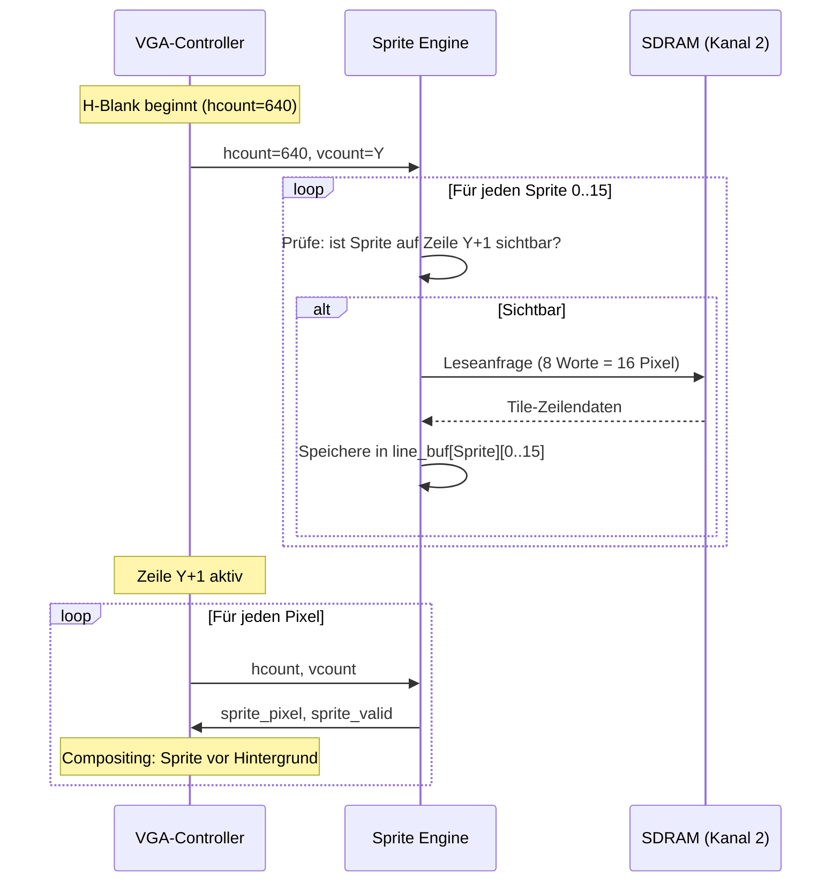

### Sprite-Priorität

Sprite 0 hat die höchste Priorität. Wenn mehrere Sprites denselben Pixel
überlagern, gewinnt der mit dem kleinsten Index.

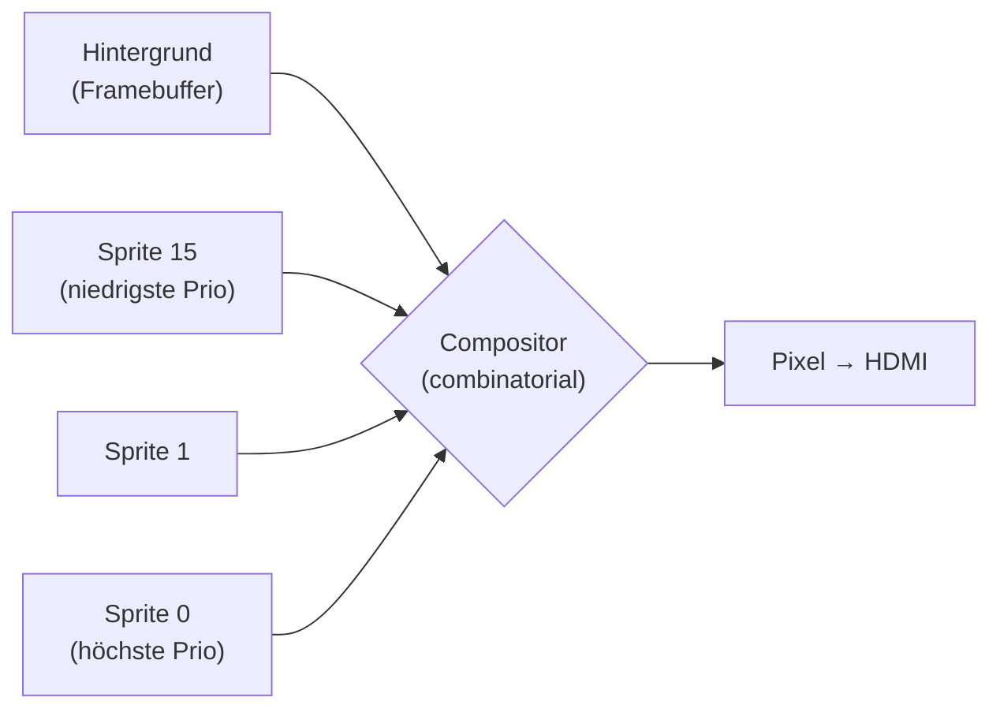

### 8.5.1 SystemVerilog: sprite_engine.sv

```systemverilog
// =============================================================================
// sprite_engine.sv — Hardware-Sprite-Engine für Atlas 16
//
// 16 Sprites, je 16×16 Pixel @ 8bpp
// Fetch während H-Blank, Compositing während aktiver Bildzeit
// SDRAM-Kanal 2 (niedrigste Priorität)
// =============================================================================
module sprite_engine (
    input  logic        clk,        // 50 MHz Systemtakt
    input  logic        rst,
    // CPU-Register-Interface (0x6100–0x617F)
    input  logic  [6:0] reg_addr,
    input  logic [15:0] reg_wdata,
    input  logic        reg_write,
    // VGA-Timing (von vga_controller)
    input  logic  [9:0] hcount,
    input  logic  [9:0] vcount,
    // SDRAM-DMA (Kanal 2)
    output logic [26:0] sdram_addr,
    input  logic [15:0] sdram_data,
    output logic        sdram_req,
    input  logic        sdram_ack,
    // Compositor-Ausgabe
    output logic  [7:0] sprite_pixel,
    output logic        sprite_valid
);
    localparam int H_ACTIVE  = 640;
    localparam int IMG_X_OFF = 64;
    localparam int IMG_Y_OFF = 112;
    localparam int IMG_W     = 512;
    localparam int IMG_H     = 256;
    localparam int NUM_SPRS  = 16;
    localparam int SPR_SIZE  = 16;
    localparam int ROW_WORDS = 8;   // 16 Pixel × 8bpp / 16-bit = 8 Worte

    // Sprite-Attribut-Register: 16 Sprites × 8 Register
    logic [15:0] spr_regs [0:127];

    always_ff @(posedge clk) begin
        integer j;
        if (rst) begin
            for (j = 0; j < 128; j = j + 1)
                spr_regs[j] <= 16'h0000;
        end else if (reg_write)
            spr_regs[reg_addr] <= reg_wdata;
    end

    // Zeilenpuffer: 16 Sprites × 16 Pixel
    logic [7:0] line_buf [0:NUM_SPRS-1][0:SPR_SIZE-1];

    // Attribute des aktuell zu fetchenden Sprites
    logic [3:0]   fetch_spr;
    logic [2:0]   fetch_word;
    logic [3:0]   fetch_tile_row;
    logic [8:0]   cur_spr_x;
    logic [7:0]   cur_spr_y;
    logic [26:0]  cur_tile_addr;
    logic [3:0]   cur_flags;
    logic         cur_active, cur_flip_x, cur_flip_y;

    assign cur_spr_x     = spr_regs[{fetch_spr, 3'd0}][8:0];
    assign cur_spr_y     = spr_regs[{fetch_spr, 3'd1}][7:0];
    assign cur_tile_addr = {spr_regs[{fetch_spr, 3'd3}][10:0],
                            spr_regs[{fetch_spr, 3'd2}][15:0]};
    assign cur_flags     = spr_regs[{fetch_spr, 3'd4}][3:0];
    assign cur_active    = cur_flags[0];
    assign cur_flip_x    = cur_flags[1];
    assign cur_flip_y    = cur_flags[2];

    // Sichtbarkeitsprüfung für nächste Zeile
    logic [9:0]  next_vcount;
    logic [8:0]  next_img_y_ext, spr_y_ext;
    logic        spr_on_line;
    logic [3:0]  spr_tile_row;

    assign next_vcount   = (vcount == 10'd524) ? 10'd0 : vcount + 10'd1;
    assign next_img_y_ext = (next_vcount >= IMG_Y_OFF) ?
                             next_vcount - IMG_Y_OFF : 9'h1FF;
    assign spr_y_ext      = {1'b0, cur_spr_y};
    assign spr_on_line    = cur_active &&
                            (next_img_y_ext < IMG_H) &&
                            (next_img_y_ext >= spr_y_ext) &&
                            (next_img_y_ext <  spr_y_ext + SPR_SIZE);
    assign spr_tile_row   = cur_flip_y ?
                            (4'd15 - (next_img_y_ext[3:0] - cur_spr_y[3:0])) :
                            (next_img_y_ext[3:0] - cur_spr_y[3:0]);

    // SDRAM-Fetch-Adresse
    logic [26:0] fetch_sdram_addr;
    assign fetch_sdram_addr = cur_tile_addr +
                              {23'h0, fetch_tile_row} * ROW_WORDS +
                              {24'h0, fetch_word};

    // Fetch-State-Machine
    typedef enum logic [2:0] {
        FS_IDLE, FS_SCAN, FS_FETCH_REQ,
        FS_FETCH_WAIT, FS_FETCH_STORE, FS_NEXT_SPRITE
    } fetch_state_t;

    fetch_state_t fetch_state;

    always_ff @(posedge clk) begin
        integer p, q;
        if (rst) begin
            fetch_state <= FS_IDLE; fetch_spr <= 4'h0;
            fetch_word  <= 3'h0; fetch_tile_row <= 4'h0;
            for (p = 0; p < NUM_SPRS; p = p + 1)
                for (q = 0; q < SPR_SIZE; q = q + 1)
                    line_buf[p][q] <= 8'h00;
        end else begin
            unique case (fetch_state)
                FS_IDLE: begin
                    if (hcount == H_ACTIVE) begin
                        fetch_spr <= 4'h0; fetch_state <= FS_SCAN;
                    end
                end
                FS_SCAN: begin
                    if (spr_on_line) begin
                        fetch_word <= 3'h0; fetch_tile_row <= spr_tile_row;
                        fetch_state <= FS_FETCH_REQ;
                    end else
                        fetch_state <= FS_NEXT_SPRITE;
                end
                FS_FETCH_REQ:  fetch_state <= FS_FETCH_WAIT;
                FS_FETCH_WAIT: begin
                    if (sdram_ack) fetch_state <= FS_FETCH_STORE;
                end
                FS_FETCH_STORE: begin
                    // 2 Pixel pro Wort speichern (High = links, Low = rechts)
                    if (cur_flip_x) begin
                        line_buf[fetch_spr][15 - {1'b0, fetch_word, 1'b0}]
                            <= sdram_data[15:8];
                        line_buf[fetch_spr][15 - {1'b0, fetch_word, 1'b1}]
                            <= sdram_data[7:0];
                    end else begin
                        line_buf[fetch_spr][{1'b0, fetch_word, 1'b0}]
                            <= sdram_data[15:8];
                        line_buf[fetch_spr][{1'b0, fetch_word, 1'b1}]
                            <= sdram_data[7:0];
                    end
                    if (fetch_word == ROW_WORDS - 1)
                        fetch_state <= FS_NEXT_SPRITE;
                    else begin
                        fetch_word  <= fetch_word + 1'b1;
                        fetch_state <= FS_FETCH_REQ;
                    end
                end
                FS_NEXT_SPRITE: begin
                    if (fetch_spr == 4'd15)
                        fetch_state <= FS_IDLE;
                    else begin
                        fetch_spr   <= fetch_spr + 1'b1;
                        fetch_state <= FS_SCAN;
                    end
                end
                default: fetch_state <= FS_IDLE;
            endcase
        end
    end

    assign sdram_req  = (fetch_state == FS_FETCH_REQ);
    assign sdram_addr = fetch_sdram_addr;

    // Kombinatorisches Compositing: Sprite 0 hat höchste Priorität
    integer i;
    logic [8:0] comp_img_x, comp_img_y;
    logic       comp_in_image;

    assign comp_img_x    = hcount[8:0] - IMG_X_OFF[8:0];
    assign comp_img_y    = {1'b0, vcount[7:0]} - IMG_Y_OFF[8:0];
    assign comp_in_image = (hcount >= IMG_X_OFF && hcount < IMG_X_OFF + IMG_W) &&
                           (vcount >= IMG_Y_OFF && vcount < IMG_Y_OFF + IMG_H);

    always_comb begin
        sprite_pixel = 8'h00;
        sprite_valid = 1'b0;
        if (comp_in_image) begin
            // Sprite 15 bis 0 prüfen (0 überschreibt → höchste Priorität)
            for (i = 15; i >= 0; i = i - 1) begin
                if (spr_regs[i*8 + 4][0]) begin  // aktiv?
                    if (comp_img_x >= {1'b0, spr_regs[i*8][7:0]} &&
                        comp_img_x <  {1'b0, spr_regs[i*8][7:0]} + SPR_SIZE) begin
                        begin
                            logic [3:0] px_idx;
                            logic [7:0] px_col;
                            px_idx = comp_img_x[3:0] - spr_regs[i*8][3:0];
                            if (spr_regs[i*8+4][1]) px_idx = 4'd15 - px_idx;
                            px_col = line_buf[i][px_idx];
                            if (px_col != spr_regs[i*8+5][7:0]) begin
                                sprite_pixel = px_col;
                                sprite_valid = 1'b1;
                            end
                        end
                    end
                end
            end
        end
    end

endmodule
```

> **Hinweis:** Die lokalen Variablendeklarationen (`logic px_idx`, `logic px_col`)
> innerhalb des `always_comb`-Blocks sind eine Eigenschaft von SystemVerilog
> (IEEE 1800). Quartus Prime unterstützt diese Syntax auch in der Lite-Edition.
> Falls Syntheseprobleme auftreten, können diese Variablen alternativ auf
> Modulebene deklariert werden.

---

# 9 Sound-Chip und MIDI

## 9.1 Wie klingt ein Square Wave?

Ein Square-Wave-Oszillator ist die einfachste Methode, einen Ton zu erzeugen:

```
Ausgabe: ‾‾‾‾|____|‾‾‾‾|____|‾‾‾‾|
              ← T/2 →← T/2 →
         Frequenz f = 1/T
```

Der Ausgang wechselt regelmäßig zwischen 0 und 1. Die Frequenz wird
durch einen Zähler gesteuert: Zähle von N bis 0, dann toggle.

```systemverilog
// Square-Wave-Kanal (ein einzelner Kanal)
// freq_div: Wert des Frequenzteilers
// Ausgangsfrequenz = clk_freq / (2 * freq_div)
// Beispiel: 50 MHz / (2 × 56818) ≈ 440 Hz (Kammerton A)
module sq_oscillator (
    input  logic        clk,
    input  logic        rst,
    input  logic [15:0] freq_div,
    input  logic  [3:0] volume,
    output logic        audio_out
);
    logic [15:0] counter;
    logic        phase;

    always_ff @(posedge clk) begin
        if (rst || freq_div == 0) begin
            counter   <= 16'h0;
            phase     <= 1'b0;
            audio_out <= 1'b0;
        end else begin
            if (counter == 0) begin
                counter   <= freq_div - 1;
                phase     <= ~phase;
                // Lautstärke: volume=0 → aus, volume=15 → volle Lautstärke
                audio_out <= phase & (volume != 4'h0);
            end else begin
                counter <= counter - 1;
            end
        end
    end
endmodule
```

## 9.2 PCM-Sample-Wiedergabe

Mit PCM (Pulse Code Modulation) können echte Sounds aus dem SDRAM
abgespielt werden. Ein PCM-Kanal liest Samples aus dem SDRAM und
gibt sie über einen PWM-DAC aus:

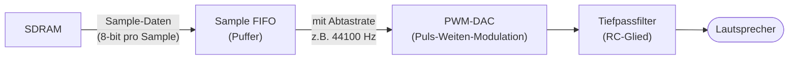

**PWM-DAC:** Anstatt einen echten Digital-Analog-Wandler zu bauen,
modulieren wir die Pulsweite eines digitalen Ausgangssignals.
Ein einfaches RC-Tiefpassfilter am GPIO-Pin glättet das Signal
zu einer analogen Spannung. Einfach und effektiv für FPGA-Projekte.

## 9.3 MIDI — Musical Instrument Digital Interface

MIDI (1983) ist ein serielles Protokoll zur Musiksteuerung:

- **Baudrate:** 31.250 bps (fest, nicht konfigurierbar)
- **Format:** 8N1 (8 Datenbits, kein Paritybit, 1 Stoppbit)
- **Nachrichten:** Note On, Note Off, Pitch Bend, Program Change, ...

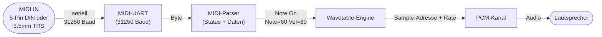

### MIDI-Nachrichtenformat

```
Status-Byte:  1xxx xxxx  (Bit 7 = 1)
  0x9n = Note On,  Kanal n
  0x8n = Note Off, Kanal n
  0xEn = Pitch Bend

Daten-Bytes: 0xxx xxxx  (Bit 7 = 0)
  Note On: [0x9n] [note 0-127] [velocity 0-127]
  Beispiel: [0x90] [0x3C] [0x50]
             Ch.0   C4    velocity=80
```

Die **Wavetable-Engine** ordnet jeder MIDI-Notennummer (0–127) eine
Sample-Adresse im SDRAM zu. Mit 128 MB haben wir genug Platz für
einen vollständigen General-MIDI-Soundsatz (~4–8 MB).

## 9.4 Sound-Register (0x6300–0x6331)

| Adresse | Register    | Beschreibung                            |
|---------|-------------|-----------------------------------------|
| 0x6300  | SQ0_FREQ    | Frequenzteiler Square-Wave Kanal 0      |
| 0x6301  | SQ0_VOL     | Lautstärke Kanal 0 (0=stumm, 15=max)   |
| 0x6302  | SQ1_FREQ    | Frequenzteiler Square-Wave Kanal 1      |
| 0x6303  | SQ1_VOL     | Lautstärke Kanal 1                      |
| 0x6310  | PCM0_ADDR_LO| PCM-Kanal 0: Sample-Adresse SDRAM (low) |
| 0x6311  | PCM0_ADDR_HI| PCM-Kanal 0: Sample-Adresse SDRAM (high)|
| 0x6312  | PCM0_LEN    | Sample-Länge in Bytes                   |
| 0x6313  | PCM0_RATE   | Abtastrate-Teiler                       |
| 0x6314  | PCM0_VOL    | Lautstärke (0–255)                      |
| 0x6315  | PCM0_CTRL   | Bit 0: play,  Bit 1: loop               |
| ...     | PCM1–PCM3   | identisch, Offset +6                    |
| 0x6330  | MIDI_RX     | Empfangenes MIDI-Byte (read-only)       |
| 0x6331  | MIDI_STATUS | Bit 0: RX_READY,  Bit 1: TX_READY      |

---

# 10 Weitere Peripherie

## 10.1 UART Terminal

Ein **UART** (Universal Asynchronous Receiver Transmitter) ist die
einfachste Form serieller Kommunikation. Ein Startbit, 8 Datenbits,
ein Stoppbit — kein Takt nötig, beide Seiten sind auf dieselbe
Baudrate konfiguriert.

```
Leerlauf: ────────────────────────
Start:          |____
Datenbits:           [D0][D1][D2][D3][D4][D5][D6][D7]
Stopp:                                               ‾|
```

### UART-Register (0x6400–0x6401)

| Adresse | Register    | Beschreibung                                       |
|---------|-------------|----------------------------------------------------|
| 0x6400  | UART_DATA   | Schreiben = Byte senden / Lesen = empfangenes Byte |
| 0x6401  | UART_STATUS | Bit 0: TX_READY (bereit zum Senden)                |
|         |             | Bit 1: RX_AVAILABLE (Byte empfangen)               |

### 10.1.1 SystemVerilog: uart.sv

Das CPU-Interface verwendet einen einzigen Adressbit:
- `reg_addr = 0`: UART_DATA (schreiben = senden, lesen = empfangen)
- `reg_addr = 1`: UART_STATUS (Bit 0 = TX_READY, Bit 1 = RX_AVAILABLE)

```systemverilog
// =============================================================================
// uart.sv — Serielles Terminal (UART, 8N1)
// Standard: 115.200 Baud bei 50 MHz Systemtakt
// =============================================================================
module uart #(
    parameter int CLK_HZ = 50_000_000,
    parameter int BAUD   = 115_200
) (
    input  logic       clk,
    input  logic       rst,
    input  logic       rx,
    output logic       tx,
    // CPU-Interface (reg_addr: 0=DATA, 1=STATUS)
    input  logic       reg_addr,
    input  logic [7:0] reg_wdata,
    input  logic       reg_write,
    output logic [7:0] reg_rdata
);
    localparam int CLKS_PER_BIT = CLK_HZ / BAUD;  // 434 bei 50 MHz / 115200

    // TX-Zustandsautomat
    typedef enum logic [1:0] { TX_IDLE, TX_START, TX_DATA, TX_STOP } tx_state_t;
    tx_state_t tx_state;

    logic [15:0] tx_clk_cnt;
    logic  [2:0] tx_bit_idx;
    logic  [7:0] tx_shift;
    logic        tx_ready;

    always_ff @(posedge clk) begin
        if (rst) begin
            tx_state <= TX_IDLE; tx <= 1'b1; tx_ready <= 1'b1;
        end else begin
            unique case (tx_state)
                TX_IDLE: begin
                    tx <= 1'b1; tx_ready <= 1'b1;
                    if (reg_write && reg_addr == 1'b0) begin
                        tx_shift <= reg_wdata; tx_clk_cnt <= CLKS_PER_BIT - 1;
                        tx_ready <= 1'b0; tx_state <= TX_START;
                    end
                end
                TX_START: begin
                    tx <= 1'b0;
                    if (tx_clk_cnt == 0) begin
                        tx_clk_cnt <= CLKS_PER_BIT - 1;
                        tx_bit_idx <= 3'h0; tx_state <= TX_DATA;
                    end else tx_clk_cnt <= tx_clk_cnt - 1;
                end
                TX_DATA: begin
                    tx <= tx_shift[tx_bit_idx];
                    if (tx_clk_cnt == 0) begin
                        tx_clk_cnt <= CLKS_PER_BIT - 1;
                        if (tx_bit_idx == 3'd7) tx_state <= TX_STOP;
                        else tx_bit_idx <= tx_bit_idx + 1;
                    end else tx_clk_cnt <= tx_clk_cnt - 1;
                end
                TX_STOP: begin
                    tx <= 1'b1;
                    if (tx_clk_cnt == 0) tx_state <= TX_IDLE;
                    else tx_clk_cnt <= tx_clk_cnt - 1;
                end
            endcase
        end
    end

    // RX-Zustandsautomat (mit 2-FF-Eingangs-Synchronisierung)
    typedef enum logic [1:0] { RX_IDLE, RX_START, RX_DATA, RX_STOP } rx_state_t;
    rx_state_t rx_state;

    logic [15:0] rx_clk_cnt;
    logic  [2:0] rx_bit_idx;
    logic  [7:0] rx_shift, rx_data;
    logic        rx_available;
    logic        rx_sync_0, rx_sync;

    // 2 Flip-Flops gegen Metastabilität am Eingang
    always_ff @(posedge clk) begin
        rx_sync_0 <= rx; rx_sync <= rx_sync_0;
    end

    always_ff @(posedge clk) begin
        if (rst) begin
            rx_state <= RX_IDLE; rx_available <= 1'b0;
        end else begin
            unique case (rx_state)
                RX_IDLE: begin
                    rx_available <= 1'b0;
                    if (!rx_sync) begin
                        rx_clk_cnt <= CLKS_PER_BIT / 2;
                        rx_state   <= RX_START;
                    end
                end
                RX_START: begin
                    if (rx_clk_cnt == 0) begin
                        if (!rx_sync) begin
                            rx_clk_cnt <= CLKS_PER_BIT - 1;
                            rx_bit_idx <= 3'h0; rx_state <= RX_DATA;
                        end else rx_state <= RX_IDLE;
                    end else rx_clk_cnt <= rx_clk_cnt - 1;
                end
                RX_DATA: begin
                    if (rx_clk_cnt == 0) begin
                        rx_shift   <= {rx_sync, rx_shift[7:1]};
                        rx_clk_cnt <= CLKS_PER_BIT - 1;
                        if (rx_bit_idx == 3'd7) rx_state <= RX_STOP;
                        else rx_bit_idx <= rx_bit_idx + 1;
                    end else rx_clk_cnt <= rx_clk_cnt - 1;
                end
                RX_STOP: begin
                    if (rx_clk_cnt == 0) begin
                        if (rx_sync) begin
                            rx_data <= rx_shift; rx_available <= 1'b1;
                        end
                        rx_state <= RX_IDLE;
                    end else rx_clk_cnt <= rx_clk_cnt - 1;
                end
            endcase
            // Lesen (reg_addr=0, kein Schreiben) löscht RX_AVAILABLE
            if (!reg_addr && !reg_write)
                rx_available <= 1'b0;
        end
    end

    // Lesemultiplexer
    always_comb begin
        if (reg_addr == 1'b0)
            reg_rdata = rx_data;
        else
            reg_rdata = {6'h0, rx_available, tx_ready};
    end

endmodule
```

## 10.2 Echtzeituhr (RTC)

Die RTC-Werte kommen vom HPS-Linux (Systemzeit) und werden
regelmäßig über die Mailbox aktualisiert. Der FPGA-Teil zählt
Sekunden selbstständig weiter.

### RTC-Register (0x6410–0x6415)

| Adresse | Register | Inhalt          |
|---------|----------|-----------------|
| 0x6410  | RTC_SEC  | Sekunden (0–59) |
| 0x6411  | RTC_MIN  | Minuten (0–59)  |
| 0x6412  | RTC_HOUR | Stunden (0–23)  |
| 0x6413  | RTC_DAY  | Tag (1–31)      |
| 0x6414  | RTC_MON  | Monat (1–12)    |
| 0x6415  | RTC_YEAR | Jahr (z.B. 2026)|

## 10.3 Timer

### Timer-Register (0x6420–0x6423)

| Adresse | Register   | Beschreibung                              |
|---------|------------|-------------------------------------------|
| 0x6420  | TMR_CNT    | Aktueller Zählerstand (read-only)         |
| 0x6421  | TMR_RELOAD | Neustartswert nach Überlauf               |
| 0x6422  | TMR_CTRL   | Bit 0: enable,  Bit 1: IRQ-enable         |
| 0x6423  | TMR_STATUS | Bit 0: Überlauf (1=ja, Schreibe 1 löscht)|

### 10.2.1 SystemVerilog: rtc.sv

```systemverilog
// =============================================================================
// rtc.sv — Echtzeituhr (Real-Time Clock)
// Die Zeit wird vom HPS/Linux über die Mailbox eingestellt.
// Der FPGA-Teil zählt Sekunden selbstständig weiter.
// =============================================================================
module rtc (
    input  logic        clk,        // 50 MHz
    input  logic        rst,
    input  logic  [2:0] reg_addr,   // Registerauswahl 0–5
    output logic [15:0] reg_rdata,
    // HPS-Update: upd_en = 1-Takt-Puls → Zeit übernehmen
    input  logic  [7:0] upd_sec,
    input  logic  [7:0] upd_min,
    input  logic  [7:0] upd_hour,
    input  logic        upd_en
);
    localparam int TICKS_PER_SEC = 50_000_000;
    logic [25:0] tick_cnt;
    logic        sec_tick;

    always_ff @(posedge clk) begin
        if (rst) begin
            tick_cnt <= '0; sec_tick <= 1'b0;
        end else begin
            sec_tick <= 1'b0;
            if (tick_cnt == TICKS_PER_SEC - 1) begin
                tick_cnt <= '0; sec_tick <= 1'b1;
            end else tick_cnt <= tick_cnt + 1;
        end
    end

    logic [7:0] sec, min, hour, day, mon;
    logic [15:0] year;

    always_ff @(posedge clk) begin
        if (rst) begin
            sec <= 8'h00; min <= 8'h00; hour <= 8'h00;
            day <= 8'h01; mon <= 8'h01; year <= 16'd2026;
        end else if (upd_en) begin
            sec <= upd_sec; min <= upd_min; hour <= upd_hour;
        end else if (sec_tick) begin
            if (sec == 8'd59) begin
                sec <= 8'h00;
                if (min == 8'd59) begin
                    min <= 8'h00;
                    hour <= (hour == 8'd23) ? 8'h00 : hour + 1;
                end else min <= min + 1;
            end else sec <= sec + 1;
        end
    end

    always_comb begin
        unique case (reg_addr)
            3'd0: reg_rdata = {8'h00, sec};
            3'd1: reg_rdata = {8'h00, min};
            3'd2: reg_rdata = {8'h00, hour};
            3'd3: reg_rdata = {8'h00, day};
            3'd4: reg_rdata = {8'h00, mon};
            3'd5: reg_rdata = year;
            default: reg_rdata = 16'h0;
        endcase
    end
endmodule
```

## 10.3 Timer

### Timer-Register (0x6420–0x6423)

| Adresse | Register   | Beschreibung                              |
|---------|------------|-------------------------------------------|
| 0x6420  | TMR_CNT    | Aktueller Zählerstand (read-only)         |
| 0x6421  | TMR_RELOAD | Neustartswert nach Überlauf               |
| 0x6422  | TMR_CTRL   | Bit 0: enable,  Bit 1: IRQ-enable         |
| 0x6423  | TMR_STATUS | Bit 0: Überlauf (1=ja, Schreibe 1 löscht)|

### 10.3.1 SystemVerilog: timer.sv

```systemverilog
// =============================================================================
// timer.sv — Konfigurierbarer Countdown-Timer
// Zählt von RELOAD bis 0, setzt bei Überlauf das Status-Flag.
// =============================================================================
module timer (
    input  logic        clk,
    input  logic        rst,
    input  logic  [1:0] reg_addr,
    input  logic [15:0] reg_wdata,
    input  logic        reg_write,
    output logic [15:0] reg_rdata
);
    logic [15:0] cnt, reload;
    logic        enable, overflow;

    always_ff @(posedge clk) begin
        if (rst) begin
            cnt <= 16'hFFFF; reload <= 16'hFFFF;
            enable <= 1'b0;  overflow <= 1'b0;
        end else begin
            if (reg_write) begin
                unique case (reg_addr)
                    2'd1: reload <= reg_wdata;
                    2'd2: enable <= reg_wdata[0];
                    2'd3: if (reg_wdata[0]) overflow <= 1'b0;
                    default: ;
                endcase
            end
            if (enable) begin
                if (cnt == 16'h0000) begin
                    cnt <= reload; overflow <= 1'b1;
                end else cnt <= cnt - 1;
            end
        end
    end

    always_comb begin
        unique case (reg_addr)
            2'd0: reg_rdata = cnt;
            2'd1: reg_rdata = reload;
            2'd2: reg_rdata = {15'h0, enable};
            2'd3: reg_rdata = {15'h0, overflow};
        endcase
    end
endmodule
```

---

# 9.4 Eingabegeräte: Tastatur, Maus und Gamepad

## 10.4.1 Überblick: USB über HPS

Der DE10-Nano besitzt einen **USB-OTG-Port**, der direkt mit dem HPS
(ARM Cortex-A9, Linux) verbunden ist — **nicht** mit dem FPGA-Fabric.
Eine USB-Tastatur, ein Trackpad oder ein Xbox-Controller erscheinen
deshalb als normale Linux-Eingabegeräte:

```mermaid
graph LR
    USB["USB-Hub\n(OTG-Port)"] --> KBD["Drahtlose Tastatur\n+ Trackpad"]
    USB --> PAD["Xbox-Controller\n(Wireless USB)"]
    KBD -->|HID-Treiber| LIN["Linux\n/dev/input/eventX"]
    PAD -->|xpad-Treiber| LIN
    LIN -->|input_daemon| BRIDGE["HPS-FPGA\nLightweight Bridge\n0xFF200000"]
    BRIDGE --> FPGA["FPGA\nhps_mailbox.sv"]
    FPGA -->|0x6000| KBD_REG["Hack-Keyboard\n(Hack-kompatibel)"]
    FPGA -->|0x6440–| MOUSE_REG["Maus-Register"]
    FPGA -->|0x6460–| PAD_REG["Gamepad-Register"]
```

Der `input_daemon` läuft als Linux-Prozess, liest alle drei Geräte
gleichzeitig über `epoll` und schreibt den Zustand nach jeder Änderung
in die Bridge-Register.

## 10.4.2 Tastatur (0x6000 — Hack-kompatibel)

Die Tastatur ist **rückwärtskompatibel** zum Original-Hack-Computer.
Adresse `0x6000` enthält den ASCII-Code der aktuell gedrückten Taste,
oder 0 wenn keine Taste gedrückt ist. Das entspricht exakt der
Spezifikation aus [N2T] Kapitel 5, Abschnitt 5.2.4.

Zusätzlich zu den druckbaren ASCII-Zeichen unterstützt der Atlas 16
die Sondertasten der Jack OS-Spezifikation:

| Code | Taste       | Code | Taste     |
|------|-------------|------|-----------|
| 128  | Enter       | 136  | Page Up   |
| 129  | Backspace   | 137  | Page Down |
| 130  | ← Links     | 138  | Einfg     |
| 131  | ↑ Hoch      | 139  | Entf      |
| 132  | → Rechts    | 140  | Escape    |
| 133  | ↓ Runter    | 141  | F1        |
| 134  | Home        | 142  | F2        |
| 135  | End         | ...  | ...       |

**Hack-Assembly: Taste prüfen**
```asm
(WAIT_KEY)
    @KBD               // 0x6000
    D=M
    @WAIT_KEY
    D;JEQ              // solange keine Taste gedrückt

    // D enthält jetzt ASCII-Code der Taste
    @65                // 'A'
    D=D-A
    @IS_A
    D;JEQ
```

## 10.4.3 Maus / Trackpad (0x6440–0x6442)

Das Trackpad der Wireless-Tastatur erscheint in Linux als Standard-HID-Maus
mit relativen Bewegungsereignissen. Der Daemon akkumuliert die Deltas zu
einer absoluten Position im Bereich [0..511] × [0..255] (entspricht
dem 512×256-Bildbereich des Atlas 16).

| Adresse | Register   | Beschreibung                                  |
|---------|------------|-----------------------------------------------|
| 0x6440  | MOUSE_X    | Absolute X-Position (0–511)                   |
| 0x6441  | MOUSE_Y    | Absolute Y-Position (0–255)                   |
| 0x6442  | MOUSE_BTN  | Bit 0: Linke Taste, Bit 1: Rechte Taste       |
|         |            | Bit 2: Mittlere Taste, Bit 3: Tap             |
|         |            | Bit 15: Verbunden (1 = Maus vorhanden)        |

**Hack-Assembly: Mausposition lesen und Pixel zeichnen**
```asm
    @MOUSE_X           // 0x6440
    D=M                // D = Maus-X (0–511)
    @cursor_x
    M=D                // lokale Variable speichern

    @MOUSE_Y           // 0x6441
    D=M                // D = Maus-Y (0–255)
    @cursor_y
    M=D

    // Linke Maustaste gedrückt?
    @MOUSE_BTN         // 0x6442
    D=M
    @1                 // Bit 0 = linke Taste
    D=D&A
    @DRAW_PIXEL
    D;JNE              // JNE statt JGT für Bit-Test
```

## 10.4.4 Gamepad (0x6460–0x6463)

Ein Xbox-Controller (drahtlos via USB-Receiver) wird von Linuxs
`xpad`-Treiber erkannt. Er erscheint als vollständiges evdev-Gerät
mit Buttons, Analogachsen und Triggern.

| Adresse | Register   | Beschreibung                                      |
|---------|------------|---------------------------------------------------|
| 0x6460  | PAD_BTN    | Button-Bitmask (s.u.)                             |
| 0x6461  | PAD_LEFT   | Linker Stick: [7:0]=X, [15:8]=Y (0–255, M=128)   |
| 0x6462  | PAD_RIGHT  | Rechter Stick: [7:0]=X, [15:8]=Y                 |
| 0x6463  | PAD_TRG    | Trigger: [7:0]=LT, [15:8]=RT (0–255)             |
|         |            | Bit 15: Verbunden                                 |

**PAD_BTN Bit-Belegung:**

```
Bit  0: A        Bit  4: LB (linke Schulter)   Bit  8: DPad ↑
Bit  1: B        Bit  5: RB (rechte Schulter)  Bit  9: DPad ↓
Bit  2: X        Bit  6: Start                 Bit 10: DPad ←
Bit  3: Y        Bit  7: Back/Select           Bit 11: DPad →
                 Bit 12: LS  Bit 13: RS  Bit 14: Xbox  Bit 15: Verbunden
```

**Hack-Assembly: Pong-Steuerung mit Gamepad**
```asm
// Schläger nach oben: DPad Hoch (Bit 8) ODER linker Stick oben (Y < 64)
(MOVE_PADDLE)
    @PAD_BTN           // 0x6460
    D=M
    @256               // Bit 8 = DPad Hoch
    D=D&A
    @MOVE_UP
    D;JNE              // DPad Hoch gedrückt?

    // Linker Stick: Y < 64 → oben
    @PAD_LEFT          // 0x6461
    D=M
    @255
    D=D&A              // Low-Byte = X (ignorieren), High-Byte = Y
    // Hinweis: für Y-Wert zunächst 8x nach rechts shiften (nicht direkt in Hack)
    // Alternative: Y-Byte separat lesen mit Bit-Maske
```

> **Hinweis zu Analogwerten in Hack:** Die 16-bit Hack-ALU kann keine
> 8-bit Subfelder direkt extrahieren. Den Y-Anteil von PAD_LEFT berechnet
> man mit: `M >> 8` ist in Hack nicht direkt möglich — stattdessen empfiehlt
> sich, den Y-Wert in einem separaten Register zu speichern oder nur die
> Digitaltasten (DPad + Buttons) für einfache Spiele zu nutzen.

## 10.4.5 Mehrere Tasten gleichzeitig

Das Gamepad unterstützt nativ mehrere gleichzeitige Eingaben (Bitmask).
Die Tastatur speichert nur **eine** Taste gleichzeitig (Hack-Einschränkung).
Für Spiele, die mehrere Tasten brauchen (z.B. Diagonalbewegung), ist
das **Gamepad die empfohlene Wahl**.

```mermaid
graph LR
    subgraph Einfache_Spiele["Einfache Spiele (Snake, Pong)"]
        KBD_SIMPLE["Tastatur\neine Taste = eine Richtung"]
        PAD_DPAD["Gamepad DPad\n4 Richtungen, exklusiv"]
    end
    subgraph Komplexe_Spiele["Komplexe Spiele (Jump'n'Run)"]
        PAD_ANALOG["Gamepad Analog + Buttons\nfließende Bewegung + Springen"]
    end
    subgraph Menüs["Menüs / Text"]
        KBD_MENU["Tastatur\nText, ASCII-Eingabe"]
        MOUSE_MENU["Maus/Trackpad\nCursor, Klicks"]
    end
```

---

# 11 HPS-Bridge und Bootprozess

## 11.1 Was ist die HPS-FPGA Bridge?

Der Intel Cyclone V SoC enthält auf demselben Die:
- Den **ARM Cortex-A9** (HPS — Hard Processor System)
- Den **FPGA-Kern**

Beide sind über eine schnelle interne Verbindung gekoppelt, die
**HPS-to-FPGA Lightweight Bridge**. Aus Sicht von Linux ist sie
ein normaler Speicherbereich (`/dev/mem`, ab Adresse `0xFF200000`).
Aus Sicht des FPGA ist sie ein Bus-Slave-Port.

```mermaid
graph LR
    subgraph HPS ["HPS (ARM Linux)"]
        LIN["Linux Prozess\nöffnet /dev/mem"]
    end
    subgraph BRIDGE ["AXI Lightweight Bridge\n(0xFF200000 → FPGA)"]
    end
    subgraph FPGA ["FPGA"]
        MBOX["HPS Mailbox\nRegisters"]
        ROM["Instruction ROM"]
    end
    LIN -->|"mmap(0xFF200000)"| BRIDGE
    BRIDGE --> MBOX
    BRIDGE --> ROM
```

## 11.2 Mailbox-Protokoll

```
HPS schreibt:  MB_ADDR = 0x0100  (Zieladresse im ROM)
               MB_DATA = 0xEC10  (Instruktionswort)
               MB_CMD  = 0x02    (LOAD_ROM)

FPGA-Logik:    Erkennt LOAD_ROM → schreibt MB_DATA nach ROM[MB_ADDR]
               Setzt MB_STATUS = 0x01 (fertig)

HPS schreibt:  MB_CMD  = 0x01    (RESET)
FPGA-Logik:    Setzt rst=1 für 2 Takte → CPU startet bei PC=0
```

## 11.3 HPS-Bridge Register-Map (vollständig)

Die Bridge-Register werden von Linux über `/dev/mem` geschrieben.
Die **Wortadressen** entsprechen den Offsets im `hps_mailbox`-Modul;
die **Byte-Adressen** für `/dev/mem` sind: `0xFF200000 + Offset × 4`.

| Offset | Byte-Addr | Name         | Beschreibung                                    |
|--------|-----------|--------------|------------------------------------------------ |
| 0x00   | +0x00     | MB_CMD       | Kommando (HPS → FPGA)                           |
| 0x01   | +0x04     | MB_STATUS    | Ausführungsstatus (FPGA → HPS, 0x01 = fertig)   |
| 0x02   | +0x08     | MB_ADDR      | ROM-Zieladresse (Bits 14:0)                     |
| 0x03   | +0x0C     | MB_DATA      | ROM-Datenwort (16-bit)                          |
| 0x04   | +0x10     | MB_RTC       | Gepackte Zeit: [23:16]=Std, [15:8]=Min, [7:0]=Sek |
| 0x05   | +0x14     | KBD_KEY      | ASCII-Code der aktuellen Taste (0 = keine)      |
| 0x06   | +0x18     | MOUSE_X      | Maus: absolute X-Position (0–511)               |
| 0x07   | +0x1C     | MOUSE_Y      | Maus: absolute Y-Position (0–255)               |
| 0x08   | +0x20     | MOUSE_BTN    | Maus: Buttons + connected-Flag                  |
| 0x09   | +0x24     | PAD_BTN      | Gamepad: Button-Bitmask                         |
| 0x0A   | +0x28     | PAD_LEFT     | Gamepad: Linker Stick [7:0]=X, [15:8]=Y         |
| 0x0B   | +0x2C     | PAD_RIGHT    | Gamepad: Rechter Stick [7:0]=X, [15:8]=Y        |
| 0x0C   | +0x30     | PAD_TRG      | Gamepad: [7:0]=LT, [15:8]=RT, [15]=verbunden    |

### Kommandocodes

| Code | Name       | Beschreibung                        |
|------|------------|-------------------------------------|
| 0x01 | RESET      | CPU-Reset, PC → 0                   |
| 0x02 | LOAD_ROM   | Schreibe MB_DATA nach ROM[MB_ADDR]  |
| 0x03 | RTC_UPDATE | Übernehme MB_RTC_* in RTC-Register  |
| 0x04 | HALT       | Halte CPU an (rst dauerhaft)        |

## 11.4 Bootprozess

```mermaid
sequenceDiagram
    participant DEV  as Entwickler-PC
    participant HPS  as HPS (Linux)
    participant FPGA as FPGA (Atlas 16)

    HPS  ->> HPS  : u-boot bootet Linux
    HPS  ->> FPGA : Bitstream laden (fpgautil / Device Tree)
    FPGA ->> FPGA : CPU initialisiert, wartet (PC=0, ROM leer)

    DEV  ->> HPS  : SSH: programm.asm übertragen
    HPS  ->> HPS  : hackasm programm.asm → programm.hack
    loop für jede Instruktion
        HPS  ->> FPGA : MB_ADDR = n, MB_DATA = instr[n], MB_CMD = LOAD_ROM
        FPGA -->> HPS : MB_STATUS = 0x01 (fertig)
    end
    HPS  ->> FPGA : MB_CMD = RESET
    FPGA ->> FPGA : PC = 0, Programm startet
    FPGA -->> DEV : Ausgabe via HDMI + UART-Terminal
```

---

# 12 Der Hack+-Assembler (`hackasm.py`)

## 12.1 Einordnung: N2T Kapitel 7

In [N2T] Kapitel 6 implementierst du einen Assembler für die Hack-Sprache.
Der Atlas-16-Assembler `hackasm.py` baut auf dieser Basis auf und erweitert
sie um die vollständige Symbol-Tabelle aller Memory-Mapped-IO-Register des
Atlas 16.

```
Hack-Assembler [N2T]                Atlas-16-Erweiterung
─────────────────────               ────────────────────────────────────
SP LCL ARG THIS THAT                + VGA_MODE, SPRITE_0_X, …
R0–R15, SCREEN, KBD                 + SQ0_FREQ, PAD_BTN, MOUSE_X, …
Zwei-Phasen-Übersetzung             identisch — vollständig kompatibel
```

Alle Standard-Hack-Programme laufen ohne Änderung. Neue Programme können
zusätzlich alle Atlas-16-Symbole verwenden, ohne `@0x6001` ausschreiben
zu müssen.

## 12.2 Neue Symbole

```asm
// ── VGA ──────────────────────────────────
VGA_MODE        = 0x6001
VGA_FB_BASE_LO  = 0x6002
VGA_FB_BASE_HI  = 0x6003
PALETTE_0       = 0x6004
PALETTE_1       = 0x6005

// ── Sprites (je Sprite +8 auf Basisadresse) ──
SPRITE_0_X      = 0x6100
SPRITE_0_Y      = 0x6101
SPRITE_0_ADDR_L = 0x6102
SPRITE_0_ADDR_H = 0x6103
SPRITE_0_FLAGS  = 0x6104
SPRITE_0_CKEY   = 0x6105

// ── Blitter ──────────────────────────────
BLIT_SRC_LO     = 0x6200
BLIT_SRC_HI     = 0x6201
BLIT_DST_LO     = 0x6202
BLIT_DST_HI     = 0x6203
BLIT_WIDTH      = 0x6204
BLIT_HEIGHT     = 0x6205
BLIT_COLOR      = 0x6206
BLIT_COLORKEY   = 0x6207
BLIT_OP         = 0x6208
BLIT_START      = 0x6209
BLIT_BUSY       = 0x620A

// ── Sound ─────────────────────────────────
SQ0_FREQ        = 0x6300
SQ0_VOL         = 0x6301
SQ1_FREQ        = 0x6302
SQ1_VOL         = 0x6303
PCM0_ADDR_LO    = 0x6310
PCM0_ADDR_HI    = 0x6311
PCM0_LEN        = 0x6312
PCM0_RATE       = 0x6313
PCM0_VOL        = 0x6314
PCM0_CTRL       = 0x6315
MIDI_RX         = 0x6330
MIDI_STATUS     = 0x6331

// ── I/O ──────────────────────────────────
UART_DATA       = 0x6400
UART_STATUS     = 0x6401
RTC_SEC         = 0x6410
RTC_MIN         = 0x6411
RTC_HOUR        = 0x6412
TMR_RELOAD      = 0x6421
TMR_CTRL        = 0x6422
TMR_STATUS      = 0x6423
BANK_CTRL       = 0x6430

// ── Eingabegeräte (read-only für CPU) ────
MOUSE_X         = 0x6440
MOUSE_Y         = 0x6441
MOUSE_BTN       = 0x6442
PAD_BTN         = 0x6460
PAD_LEFT        = 0x6461
PAD_RIGHT       = 0x6462
PAD_TRG         = 0x6463

// ── Gamepad-Button-Masken (für PAD_BTN) ──
PAD_A           = 1         // Bit 0
PAD_B           = 2         // Bit 1
PAD_X           = 4         // Bit 2
PAD_Y           = 8         // Bit 3
PAD_LB          = 16        // Bit 4
PAD_RB          = 32        // Bit 5
PAD_START       = 64        // Bit 6
PAD_BACK        = 128       // Bit 7
PAD_DPAD_UP     = 256       // Bit 8
PAD_DPAD_DOWN   = 512       // Bit 9
PAD_DPAD_LEFT   = 1024      // Bit 10
PAD_DPAD_RIGHT  = 2048      // Bit 11
PAD_CONNECTED   = 32768     // Bit 15
```

## 12.3 Zwei-Phasen-Übersetzung

Der Assembler arbeitet in zwei Durchläufen — genau wie in [N2T] beschrieben:

```mermaid
flowchart LR
    SRC["programm.asm"]
    P1["1. Durchlauf\nLabels sammeln\n→ symbol_table"]
    P2["2. Durchlauf\nÜbersetzen\nVariablen ab RAM[16]"]
    OUT[".hack\nASCII-Binär"]

    SRC --> P1 --> P2 --> OUT
```

**Erster Durchlauf** (`first_pass`):
- Alle Zeilen werden gelesen, Kommentare und Leerzeilen ignoriert.
- Label-Deklarationen `(LABEL)` werden in die Symbol-Tabelle eingetragen
  und zählen nicht als Instruktionen.
- Am Ende enthält die Tabelle alle Labels mit ihrer Instruktionsadresse.

**Zweiter Durchlauf** (`second_pass`):
- A-Instruktionen (`@SYMBOL`) werden aufgelöst: bekannte Symbole werden
  direkt ersetzt; unbekannte werden als neue Variablen ab RAM-Adresse 16
  eingetragen.
- C-Instruktionen werden Bit für Bit kodiert: `111 a cccccc ddd jjj`.

## 12.4 Vollständige Implementierung

```python
#!/usr/bin/env python3
# hackasm.py — Hack+ Assembler für Atlas 16
# Verwendung: python3 hackasm.py programm.asm [-o out.hack] [--bin]

import sys, os, argparse

# ── Vordefinierte Symbole ──────────────────────────────────────────────────
PREDEFINED = {
    # N2T Standard-Register
    'R0': 0,  'R1': 1,  'R2': 2,  'R3': 3,
    'R4': 4,  'R5': 5,  'R6': 6,  'R7': 7,
    'R8': 8,  'R9': 9, 'R10':10, 'R11':11,
    'R12':12, 'R13':13, 'R14':14, 'R15':15,
    # N2T VM-Zeiger
    'SP':0, 'LCL':1, 'ARG':2, 'THIS':3, 'THAT':4,
    # N2T Legacy I/O
    'SCREEN':0x4000, 'KBD':0x6000,
    # VGA
    'VGA_MODE':0x6001, 'VGA_FB_BASE_LO':0x6002, 'VGA_FB_BASE_HI':0x6003,
    'PALETTE_0':0x6004, 'PALETTE_1':0x6005,
    # Sprites (Sprite 0; Sprite n: Basisadresse + n×8)
    'SPRITE_0_X':0x6100, 'SPRITE_0_Y':0x6101,
    'SPRITE_0_ADDR_L':0x6102, 'SPRITE_0_ADDR_H':0x6103,
    'SPRITE_0_FLAGS':0x6104, 'SPRITE_0_CKEY':0x6105,
    # Blitter
    'BLIT_SRC_LO':0x6200, 'BLIT_SRC_HI':0x6201,
    'BLIT_DST_LO':0x6202, 'BLIT_DST_HI':0x6203,
    'BLIT_WIDTH':0x6204,  'BLIT_HEIGHT':0x6205,
    'BLIT_COLOR':0x6206,  'BLIT_COLORKEY':0x6207,
    'BLIT_OP':0x6208,     'BLIT_START':0x6209, 'BLIT_BUSY':0x620A,
    # Sound
    'SQ0_FREQ':0x6300, 'SQ0_VOL':0x6301,
    'SQ1_FREQ':0x6302, 'SQ1_VOL':0x6303,
    'PCM0_ADDR_LO':0x6310, 'PCM0_ADDR_HI':0x6311,
    'PCM0_LEN':0x6312, 'PCM0_RATE':0x6313,
    'PCM0_VOL':0x6314, 'PCM0_CTRL':0x6315,
    'MIDI_RX':0x6330, 'MIDI_STATUS':0x6331,
    # UART / RTC / Timer / Bank
    'UART_DATA':0x6400, 'UART_STATUS':0x6401,
    'RTC_SEC':0x6410, 'RTC_MIN':0x6411, 'RTC_HOUR':0x6412,
    'TMR_CNT':0x6420, 'TMR_RELOAD':0x6421,
    'TMR_CTRL':0x6422, 'TMR_STATUS':0x6423,
    'BANK_CTRL':0x6430,
    # Eingabegeräte (read-only für CPU)
    'MOUSE_X':0x6440, 'MOUSE_Y':0x6441, 'MOUSE_BTN':0x6442,
    'PAD_BTN':0x6460, 'PAD_LEFT':0x6461,
    'PAD_RIGHT':0x6462, 'PAD_TRG':0x6463,
    # Gamepad-Button-Masken
    'PAD_A':1,   'PAD_B':2,    'PAD_X':4,    'PAD_Y':8,
    'PAD_LB':16, 'PAD_RB':32,  'PAD_START':64,'PAD_BACK':128,
    'PAD_DPAD_UP':256, 'PAD_DPAD_DOWN':512,
    'PAD_DPAD_LEFT':1024, 'PAD_DPAD_RIGHT':2048,
    'PAD_CONNECTED':32768,
}

# ── C-Instruktions-Tabellen (gemäß [N2T] Anhang A) ────────────────────────
COMP_TABLE = {
    '0':'0101010','1':'0111111','-1':'0111010',
    'D':'0001100','A':'0110000','!D':'0001101','!A':'0110001',
    '-D':'0001111','-A':'0110011',
    'D+1':'0011111','A+1':'0110111','D-1':'0001110','A-1':'0110010',
    'D+A':'0000010','D-A':'0010011','A-D':'0000111',
    'D&A':'0000000','D|A':'0010101',
    'M':'1110000','!M':'1110001','-M':'1110011',
    'M+1':'1110111','M-1':'1110010',
    'D+M':'1000010','D-M':'1010011','M-D':'1000111',
    'D&M':'1000000','D|M':'1010101',
}
DEST_TABLE = {
    '':'000','M':'001','D':'010','MD':'011',
    'A':'100','AM':'101','AD':'110','AMD':'111',
}
JUMP_TABLE = {
    '':'000','JGT':'001','JEQ':'010','JGE':'011',
    'JLT':'100','JNE':'101','JLE':'110','JMP':'111',
}

def strip_line(line):
    idx = line.find('//')
    if idx >= 0: line = line[:idx]
    return line.strip()

def to_bin16(value):
    if value < 0: value &= 0xFFFF
    return format(value, '016b')

def first_pass(lines):
    """Labels → Instruktionsadressen."""
    symbol_table = dict(PREDEFINED)
    instr_count = 0
    for line in lines:
        clean = strip_line(line)
        if not clean: continue
        if clean.startswith('(') and clean.endswith(')'):
            label = clean[1:-1]
            if label in symbol_table:
                raise ValueError(f"Label '{label}' bereits definiert.")
            symbol_table[label] = instr_count
        else:
            instr_count += 1
    return symbol_table

def second_pass(lines, symbol_table):
    """Instruktionen übersetzen, Variablen ab RAM[16]."""
    output = []
    next_var_addr = 16
    for lineno, line in enumerate(lines, 1):
        clean = strip_line(line)
        if not clean or (clean.startswith('(') and clean.endswith(')')):
            continue
        if clean.startswith('@'):
            sym = clean[1:]
            if sym.lstrip('-').isdigit():
                value = int(sym)
                if not (0 <= value <= 32767):
                    raise ValueError(f"Zeile {lineno}: {value} außerhalb 0–32767.")
            elif sym in symbol_table:
                value = symbol_table[sym]
            else:
                symbol_table[sym] = next_var_addr
                value = next_var_addr
                next_var_addr += 1
            output.append(to_bin16(value))
        else:
            dest, comp, jump = '', clean, ''
            if '=' in comp: dest, comp = comp.split('=', 1)
            if ';' in comp: comp, jump = comp.split(';', 1)
            dest, comp, jump = dest.strip(), comp.strip(), jump.strip()
            if comp not in COMP_TABLE:
                raise ValueError(f"Zeile {lineno}: Unbekannter comp '{comp}'.")
            if dest not in DEST_TABLE:
                raise ValueError(f"Zeile {lineno}: Unbekannter dest '{dest}'.")
            if jump not in JUMP_TABLE:
                raise ValueError(f"Zeile {lineno}: Unbekannter jump '{jump}'.")
            output.append(f'111{COMP_TABLE[comp]}{DEST_TABLE[dest]}{JUMP_TABLE[jump]}')
    return output

def assemble(source_path, output_path=None, also_binary=False):
    lines = open(source_path, encoding='utf-8').readlines()
    symbol_table  = first_pass(lines)
    binary_lines  = second_pass(lines, symbol_table)
    if output_path is None:
        output_path = os.path.splitext(source_path)[0] + '.hack'
    open(output_path, 'w', encoding='utf-8').write('\n'.join(binary_lines) + '\n')
    print(f"[hackasm] {len(binary_lines)} Instruktionen → {output_path}")
    if also_binary:
        bin_path = os.path.splitext(output_path)[0] + '.bin'
        with open(bin_path, 'wb') as f:
            for word in binary_lines:
                f.write(int(word, 2).to_bytes(2, 'big'))
        print(f"[hackasm] Binärdatei → {bin_path}")
    return binary_lines

if __name__ == '__main__':
    parser = argparse.ArgumentParser(description='Hack+ Assembler für Atlas 16')
    parser.add_argument('source')
    parser.add_argument('-o', '--output')
    parser.add_argument('--bin', action='store_true')
    args = parser.parse_args()
    try:
        assemble(args.source, args.output, args.bin)
    except (ValueError, FileNotFoundError) as e:
        print(f"Fehler: {e}", file=sys.stderr); sys.exit(1)
```

### Binärformat der Ausgabe

| Bit | 15 | 14–13 | 12 | 11 | 10–6 | 5–3 | 2–0 |
|-----|----|-------|----|----|------|-----|-----|
| A-Instr. | 0 | Wert[14:13] | … | … | … | … | Wert[2:0] |
| C-Instr. | 1 | 1 1 | a | cccccc | ddd | jjj |

Eine A-Instruktion setzt Bit 15 = 0 und kodiert den 15-bit-Wert in den
Bits 14–0. Eine C-Instruktion setzt Bits 15–13 = `111`, gefolgt von
7 Kompute-Bits (`a cccccc`), 3 Dest-Bits (`ddd`) und 3 Jump-Bits (`jjj`).

## 12.5 Beispielprogramme

### Hello World (UART)

```asm
// Schreibt 'A' (65) auf den UART
(WAIT_TX)
    @UART_STATUS
    D=M
    @WAIT_TX
    D;JEQ           // warte bis TX_READY = 1

    @65             // ASCII 'A'
    D=A
    @UART_DATA
    M=D             // senden

(END)
    @END
    0;JMP
```

### Ton spielen (Square Wave, 440 Hz bei 50 MHz)

```asm
    @56818          // 50_000_000 / (2 × 440) = 56818
    D=A
    @SQ0_FREQ
    M=D

    @15             // volle Lautstärke
    D=A
    @SQ0_VOL
    M=D

(LOOP)
    @LOOP
    0;JMP
```

### Bildschirm füllen (Blitter FILL)

```asm
    // Zieladresse: Framebuffer-Start (SDRAM 0x000000)
    @0
    D=A
    @BLIT_DST_LO
    M=D
    @BLIT_DST_HI
    M=D

    // Breite: 512, Höhe: 256
    @512
    D=A
    @BLIT_WIDTH
    M=D
    @256
    D=A
    @BLIT_HEIGHT
    M=D

    // Farbe: 42 (aus 256er-Palette)
    @42
    D=A
    @BLIT_COLOR
    M=D

    // Operation: FILL (1)
    @1
    D=A
    @BLIT_OP
    M=D

    // Starten
    @1
    D=A
    @BLIT_START
    M=D

(WAIT_BLIT)
    @BLIT_BUSY
    D=M
    @WAIT_BLIT
    D;JNE           // warte bis Blitter fertig
```

---

# 13 Der VM-Übersetzer (`vm2asm.py`)

## 13.1 Einordnung: N2T Kapitel 9–9

In [N2T] Kapitel 8–9 implementierst du einen VM-Übersetzer, der die
Hack-VM-Sprache in Hack-Assembler übersetzt. Die VM-Sprache ist
stapelbasiert: Alle Berechnungen laufen über einen einzigen Daten-Stack,
und Unterprogramme werden über einen standardisierten Aufrufrahmen verwaltet.

```
Hack VM [N2T]                  Atlas-16-Erweiterung
──────────────────────         ────────────────────────────────────
push/pop, arithmetik           identisch
label/goto/if-goto             identisch
function/call/return           identisch
—                              Atlas16.readKey / readPad / soundTone
                               Atlas16.screenPoke (inline-ASM)
```

`vm2asm.py` erzeugt direkt für den `hackasm.py`-Assembler lesbaren Code
und kann einzelne `.vm`-Dateien oder ganze Verzeichnisse übersetzen.

## 13.2 Die VM-Sprache im Überblick

### Stack-Arithmetik

Alle Operationen arbeiten auf dem Stack. Der Stack wächst nach oben; `SP`
zeigt auf das nächste freie Element (oberhalb der letzten Zahl).

```
push constant 7    // Stack: [7]
push constant 8    // Stack: [7, 8]
add                // Stack: [15]   (7 + 8)
```

### Segmente

| Segment    | Bedeutung                         | Hack-Adressierung        |
|------------|-----------------------------------|--------------------------|
| `constant` | Literalwert (nur push)            | `@n` direkt              |
| `local`    | Lokale Variablen der Funktion     | `LCL + i`                |
| `argument` | Übergebene Argumente              | `ARG + i`                |
| `this`     | Zeiger auf aktuelles Objekt       | `THIS + i`               |
| `that`     | Zeiger auf aktuelles Array        | `THAT + i`               |
| `temp`     | Kurzzeit-Temporäre (R5–R12)       | `R(5+i)`                 |
| `pointer`  | `pointer 0` = THIS, `1` = THAT   | `@THIS` / `@THAT`        |
| `static`   | Modulweite Variablen              | `@Dateiname.i`           |

### Unterprogramme

```
function Main.main 2    // Funktion mit 2 lokalen Variablen
    push argument 0     // erstes Argument
    push argument 1
    add
    return              // Ergebnis liegt auf Stack

call Main.main 2        // Aufruf mit 2 Argumenten
```

Der Aufrufrahmen (Stack Frame) folgt exakt der N2T-Spezifikation:

```
    ┌──────────┐  ← LCL (nach call)
    │ local 0  │
    │ local 1  │
    ├──────────┤
    │ saved LCL│
    │ saved ARG│  ← gespeicherte Zeiger
    │ saved THIS│
    │ saved THAT│
    │ ret-addr │
    ├──────────┤  ← ARG
    │ arg 0    │
    │ arg 1    │
    └──────────┘
```

## 13.3 Übersetzungsregeln

### `push constant n`

```asm
    @n
    D=A
    @SP
    A=M
    M=D       // RAM[SP] = n
    @SP
    M=M+1     // SP++
```

### `push local i`

```asm
    @i
    D=A
    @LCL
    A=M+D     // A = LCL + i
    D=M       // D = RAM[LCL+i]
    @SP
    A=M
    M=D
    @SP
    M=M+1
```

### `pop local i`

```asm
    @i
    D=A
    @LCL
    D=M+D     // D = Zieladresse
    @R13
    M=D       // R13 = Zieladresse (merken, da SP-Dekrement A überschreibt)
    @SP
    AM=M-1
    D=M       // D = TOS
    @R13
    A=M
    M=D       // RAM[Zieladresse] = TOS
```

### `add` (und alle anderen binären Operationen)

```asm
    @SP
    AM=M-1    // SP--, A = SP
    D=M       // D = TOS (y)
    A=A-1     // A = SP-1 (zeigt auf x)
    M=D+M     // RAM[SP-1] = x + y
```

| VM-Befehl | Hack-Operation |
|-----------|----------------|
| `add`     | `M=D+M`        |
| `sub`     | `M=M-D`        |
| `and`     | `M=D&M`        |
| `or`      | `M=D\|M`       |
| `neg`     | `M=-M`         |
| `not`     | `M=!M`         |

### `eq` / `gt` / `lt` (Vergleiche)

Vergleiche erfordern bedingte Sprünge. Das Ergebnis ist `-1` (true) oder
`0` (false) — genau wie in [N2T] spezifiziert.

```asm
// eq: x == y ?
    @SP
    AM=M-1
    D=M       // D = y
    A=A-1
    D=M-D     // D = x - y
    @TRUE.n
    D;JEQ     // Sprung wenn x-y == 0
    @SP
    A=M-1
    M=0       // false
    @END.n
    0;JMP
(TRUE.n)
    @SP
    A=M-1
    M=-1      // true
(END.n)
```

### `call f n` (Unterprogramm-Aufruf)

Der Aufruf sichert den Zustand und springt zur Funktion:

```asm
// call Main.multiply 2
    @Main.multiply$ret.1   // 1. Return-Adresse auf Stack
    D=A
    // push LCL, ARG, THIS, THAT (je 3 Zeilen)
    @ARG
    D=M
    @7                     // n_args + 5
    D=D-A
    @ARG
    M=D                    // ARG = SP - n_args - 5
    @SP
    D=M
    @LCL
    M=D                    // LCL = SP
    @Main.multiply
    0;JMP
(Main.multiply$ret.1)
```

### `return`

```asm
    @LCL
    D=M
    @R11
    M=D          // R11 = FRAME = LCL
    @5
    A=D-A
    D=M
    @R12
    M=D          // R12 = RET = *(FRAME-5)
    // pop → *ARG
    // SP = ARG+1
    // THAT=*(FRAME-1), THIS=*(FRAME-2), ARG=*(FRAME-3), LCL=*(FRAME-4)
    @R12
    A=M
    0;JMP        // goto RET
```

## 13.4 Atlas 16 I/O-Erweiterungen

Programme können Atlas-16-Hardware über `call Atlas16.xxx n` ansprechen.
Der VM-Übersetzer erkennt `Atlas16.*`-Aufrufe und bindet automatisch eine
inline-ASM-Bibliothek ein.

| Funktion                     | Argumente            | Beschreibung                  |
|------------------------------|----------------------|-------------------------------|
| `Atlas16.readKey()`          | —                    | `KBD`-Register lesen (ASCII)  |
| `Atlas16.readPad()`          | —                    | `PAD_BTN`-Register lesen      |
| `Atlas16.soundTone(ch,f,v)`  | Kanal, Frequenz, Vol | Square-Wave-Ton setzen        |
| `Atlas16.screenMode(mode)`   | 0=Legacy, 1=Atlas16  | VGA-Modus umschalten          |
| `Atlas16.screenPoke(x,y,c)`  | X, Y, Farbe          | Pixel im 8bpp-Modus setzen    |

Beispiel in VM-Code:

```
// Taste lesen und in local 0 ablegen
call Atlas16.readKey 0
pop local 0

// Ton auf Kanal 0, 440 Hz, volle Lautstärke
push constant 0
push constant 56818
push constant 15
call Atlas16.soundTone 3
pop temp 0
```

## 13.5 Vollständige Implementierung

```python
#!/usr/bin/env python3
# vm2asm.py — Hack+ VM-Übersetzer für Atlas 16
# Verwendung: python3 vm2asm.py datei.vm [-o out.asm] [--no-bootstrap]
#             python3 vm2asm.py Verzeichnis/

import sys, os, argparse

SEGMENT_BASE = {
    'local':'LCL', 'argument':'ARG', 'this':'THIS', 'that':'THAT',
}
TEMP_BASE = 5
POINTER_BASES = {0:'THIS', 1:'THAT'}
ARITH_OPS = {'add','sub','neg','eq','gt','lt','and','or','not'}

class CodeWriter:
    def __init__(self, bootstrap=True):
        self._out, self._label, self._func, self._file = [], 0, '', ''
        if bootstrap: self._write_bootstrap()

    def set_file(self, vm_path):
        self._file = os.path.splitext(os.path.basename(vm_path))[0]

    def write_arithmetic(self, cmd):
        self._emit(f'// {cmd}')
        if   cmd == 'add': self._binary('D+M')
        elif cmd == 'sub': self._binary('M-D')
        elif cmd == 'and': self._binary('D&M')
        elif cmd == 'or':  self._binary('D|M')
        elif cmd == 'neg': self._unary('-M')
        elif cmd == 'not': self._unary('!M')
        else: self._compare(cmd)

    def write_push_pop(self, cmd, seg, idx):
        self._emit(f'// {cmd} {seg} {idx}')
        if cmd == 'push': self._push(seg, idx)
        else:             self._pop(seg, idx)

    def write_label(self, lbl):
        self._emit(f'// label {lbl}')
        self._emit(f'({self._func}${lbl})')

    def write_goto(self, lbl):
        self._emit(f'// goto {lbl}')
        self._emit(f'    @{self._func}${lbl}')
        self._emit( '    0;JMP')

    def write_if_goto(self, lbl):
        self._emit(f'// if-goto {lbl}')
        self._pop_d()
        self._emit(f'    @{self._func}${lbl}')
        self._emit( '    D;JNE')

    def write_function(self, name, n_locals):
        self._emit(f'// function {name} {n_locals}')
        self._func = name
        self._emit(f'({name})')
        for _ in range(n_locals):
            self._emit('    @0'); self._emit('    D=A'); self._push_d()

    def write_call(self, name, n_args):
        self._emit(f'// call {name} {n_args}')
        ret = f'{name}$ret.{self._uid()}'
        self._emit(f'    @{ret}'); self._emit('    D=A'); self._push_d()
        for sym in ('LCL','ARG','THIS','THAT'):
            self._emit(f'    @{sym}'); self._emit('    D=M'); self._push_d()
        self._emit('    @SP'); self._emit('    D=M')
        self._emit(f'    @{n_args+5}'); self._emit('    D=D-A')
        self._emit('    @ARG'); self._emit('    M=D')
        self._emit('    @SP'); self._emit('    D=M')
        self._emit('    @LCL'); self._emit('    M=D')
        self._emit(f'    @{name}'); self._emit('    0;JMP')
        self._emit(f'({ret})')

    def write_return(self):
        self._emit('// return')
        self._emit('    @LCL');  self._emit('    D=M')
        self._emit('    @R11');  self._emit('    M=D')
        self._emit('    @5');    self._emit('    A=D-A'); self._emit('    D=M')
        self._emit('    @R12');  self._emit('    M=D')
        self._pop_d()
        self._emit('    @ARG');  self._emit('    A=M');   self._emit('    M=D')
        self._emit('    @ARG');  self._emit('    D=M+1')
        self._emit('    @SP');   self._emit('    M=D')
        for i, sym in enumerate(('THAT','THIS','ARG','LCL'), 1):
            self._emit('    @R11'); self._emit('    D=M')
            self._emit(f'    @{i}'); self._emit('    A=D-A'); self._emit('    D=M')
            self._emit(f'    @{sym}'); self._emit('    M=D')
        self._emit('    @R12');  self._emit('    A=M');  self._emit('    0;JMP')

    def close(self):
        e = self._uid()
        return '\n'.join(self._out + [f'($$END.{e})', f'    @$$END.{e}', '    0;JMP']) + '\n'

    # ── Hilfsmethoden ────────────────────────────────────────────────────
    def _emit(self, l): self._out.append(l)
    def _uid(self): self._label += 1; return self._label

    def _push_d(self):
        self._emit('    @SP'); self._emit('    A=M')
        self._emit('    M=D'); self._emit('    @SP'); self._emit('    M=M+1')

    def _pop_d(self):
        self._emit('    @SP'); self._emit('    AM=M-1'); self._emit('    D=M')

    def _binary(self, op):
        self._pop_d()
        self._emit('    A=A-1')
        self._emit(f'    M={op}')

    def _unary(self, op):
        self._emit('    @SP'); self._emit('    A=M-1')
        self._emit(f'    M={op}')

    def _compare(self, cmd):
        uid = self._uid()
        t, e = f'$$TRUE.{uid}', f'$$END.{uid}'
        jmp = {'eq':'JEQ','gt':'JGT','lt':'JLT'}[cmd]
        self._pop_d()
        self._emit('    A=A-1'); self._emit('    D=M-D')
        self._emit(f'    @{t}'); self._emit(f'    D;{jmp}')
        self._emit('    @SP'); self._emit('    A=M-1'); self._emit('    M=0')
        self._emit(f'    @{e}'); self._emit('    0;JMP')
        self._emit(f'({t})')
        self._emit('    @SP'); self._emit('    A=M-1'); self._emit('    M=-1')
        self._emit(f'({e})')

    def _push(self, seg, idx):
        if seg == 'constant':
            self._emit(f'    @{idx}'); self._emit('    D=A')
        elif seg in SEGMENT_BASE:
            self._emit(f'    @{idx}'); self._emit('    D=A')
            self._emit(f'    @{SEGMENT_BASE[seg]}')
            self._emit('    A=M+D'); self._emit('    D=M')
        elif seg == 'temp':
            self._emit(f'    @R{TEMP_BASE+idx}'); self._emit('    D=M')
        elif seg == 'pointer':
            self._emit(f'    @{POINTER_BASES[idx]}'); self._emit('    D=M')
        elif seg == 'static':
            self._emit(f'    @{self._file}.{idx}'); self._emit('    D=M')
        self._push_d()

    def _pop(self, seg, idx):
        if seg in SEGMENT_BASE:
            self._emit(f'    @{idx}'); self._emit('    D=A')
            self._emit(f'    @{SEGMENT_BASE[seg]}'); self._emit('    D=M+D')
            self._emit('    @R13'); self._emit('    M=D')
            self._pop_d()
            self._emit('    @R13'); self._emit('    A=M'); self._emit('    M=D')
        elif seg == 'temp':
            self._pop_d(); self._emit(f'    @R{TEMP_BASE+idx}'); self._emit('    M=D')
        elif seg == 'pointer':
            self._pop_d(); self._emit(f'    @{POINTER_BASES[idx]}'); self._emit('    M=D')
        elif seg == 'static':
            self._pop_d(); self._emit(f'    @{self._file}.{idx}'); self._emit('    M=D')

    def _write_bootstrap(self):
        self._emit('// Bootstrap: SP=256, call Sys.init')
        self._emit('    @256'); self._emit('    D=A')
        self._emit('    @SP'); self._emit('    M=D')
        self.write_call('Sys.init', 0)


def parse_vm(path):
    cmds = []
    for raw in open(path, encoding='utf-8'):
        line = raw.split('//')[0].strip()
        if not line: continue
        p = line.split()
        cmd = p[0].lower()
        if   cmd in ARITH_OPS:       cmds.append(('arithmetic', cmd))
        elif cmd in ('push','pop'):   cmds.append((cmd, p[1], int(p[2])))
        elif cmd == 'label':          cmds.append(('label', p[1]))
        elif cmd == 'goto':           cmds.append(('goto', p[1]))
        elif cmd == 'if-goto':        cmds.append(('if-goto', p[1]))
        elif cmd == 'function':       cmds.append(('function', p[1], int(p[2])))
        elif cmd == 'call':           cmds.append(('call', p[1], int(p[2])))
        elif cmd == 'return':         cmds.append(('return',))
        else: raise ValueError(f"Unbekannter Befehl: {cmd}")
    return cmds

def translate(sources, output_path, bootstrap=True):
    w = CodeWriter(bootstrap)
    for src in sources:
        w.set_file(src)
        for cmd in parse_vm(src):
            k = cmd[0]
            if   k == 'arithmetic': w.write_arithmetic(cmd[1])
            elif k in ('push','pop'): w.write_push_pop(k, cmd[1], cmd[2])
            elif k == 'label':      w.write_label(cmd[1])
            elif k == 'goto':       w.write_goto(cmd[1])
            elif k == 'if-goto':    w.write_if_goto(cmd[1])
            elif k == 'function':   w.write_function(cmd[1], cmd[2])
            elif k == 'call':       w.write_call(cmd[1], cmd[2])
            elif k == 'return':     w.write_return()
    open(output_path, 'w', encoding='utf-8').write(w.close())
    print(f"[vm2asm] {len(sources)} Datei(en) → {output_path}")

if __name__ == '__main__':
    parser = argparse.ArgumentParser(description='Hack+ VM-Übersetzer für Atlas 16')
    parser.add_argument('source')
    parser.add_argument('-o', '--output')
    parser.add_argument('--no-bootstrap', action='store_true')
    args = parser.parse_args()
    if os.path.isfile(args.source):
        srcs, default = [args.source], os.path.splitext(args.source)[0]+'.asm'
    else:
        name = os.path.basename(args.source.rstrip('/\\'))
        srcs  = sorted(os.path.join(args.source, f)
                       for f in os.listdir(args.source) if f.endswith('.vm'))
        default = os.path.join(args.source, name+'.asm')
    try:
        translate(srcs, args.output or default, not args.no_bootstrap)
    except (ValueError, FileNotFoundError) as e:
        print(f"Fehler: {e}", file=sys.stderr); sys.exit(1)
```

## 13.6 Komplette Toolchain — Zusammenfassung

```mermaid
flowchart LR
    ASM["*.asm\nHack-Assembler\nSource"] -->|hackasm.py| HACK["*.hack\nASCII-Binär"]
    VM["*.vm\nHack VM\nSource"] -->|vm2asm.py| ASM
    JACK["*.jack\nJack Quellcode"] -->|JackCompiler\n(N2T)| VM
    HACK -->|load.sh via SSH| ROM["Atlas 16\nInstruction ROM"]
    HACK -->|"--bin"| BIN["*.bin\nRohe Binärdatei"]
```

| Schritt | Werkzeug         | Eingabe   | Ausgabe   |
|---------|------------------|-----------|-----------|
| 1       | Jack Compiler    | `*.jack`  | `*.vm`    |
| 2       | `vm2asm.py`      | `*.vm`    | `*.asm`   |
| 3       | `hackasm.py`     | `*.asm`   | `*.hack`  |
| 4       | `load.sh` (SSH)  | `*.hack`  | Atlas 16  |

---

# 14 Projektstruktur und Werkzeuge

## 14.1 Verzeichnisstruktur

```
Atlas 16/
  Doc/
    hack_plus_lehrbuch.md     ← dieses Dokument
  Hardware/                   ← SystemVerilog Implementierungen
    hack_cpu.sv               ✓ Hack CPU + ALU
    tb_hack_cpu.sv            ✓ Testbench CPU
    hack_rom.sv               ✓ Instruction ROM (BRAM, Dual-Port)
    hack_ram.sv               ✓ Data RAM + Adressdekodierung
    sdram_ctrl.sv             ○ SDRAM-Controller (Milestone 2)
    mem_arbiter.sv            ○ Bus-Arbiter 3-Kanal (Milestone 2)
    vga_controller.sv         ✓ VGA/HDMI + Sprite-Compositing
    sprite_engine.sv          ✓ 16 Hardware-Sprites (16×16 @ 8bpp)
    blitter.sv                ✓ DMA-Blitter (COPY/FILL/STAMP)
    sound_chip.sv             ✓ Square Wave + PCM + MIDI
    uart.sv                   ✓ UART 8N1, 115200 Baud
    rtc.sv                    ✓ Echtzeituhr (HPS-Update)
    timer.sv                  ✓ Countdown-Timer
    hps_mailbox.sv            ✓ HPS-FPGA Bridge
    atlas16_top.sv            ✓ Toplevel (DE10-Nano Pin-Assignments)
  Software/
    Hack/                     ← Hack-kompatible Programme
    Atlas16/                  ← Atlas-16-spezifische Programme
    tools/
      hackasm.py              ✓ Python Hack+-Assembler (Kapitel 12)
      vm2asm.py               ✓ Python VM-Übersetzer (Kapitel 13)
      load.sh                 ○ Programmlader (SSH → HPS)
      input_daemon.c          ✓ Linux-Eingabe-Daemon (Tastatur/Maus/Gamepad)

✓ = implementiert  ○ = ausstehend (Milestone 2+)
```

## 14.2 Entwicklungsumgebung — Kurzreferenz

> Die vollständige Installation ist in Kapitel 1 beschrieben. Hier nur die
> wichtigsten Befehle als Nachschlagewerk.

**Synthese:** Intel Quartus Prime 25.1 SC Lite — `Processing → Start Compilation`

**FPGA programmieren:**
```bash
quartus_pgm -c "DE-SoC" -m JTAG -o "p;output_files/atlas16_a.sof@2"
```

**Simulation:**
```bash
iverilog -g2005-sv -o sim Hardware/hack_cpu.sv Hardware/tb_hack_cpu.sv
vvp sim && gtkwave dump.vcd
```

**Toolchain:**
```bash
python3 Software/tools/vm2asm.py spiel.vm        # VM → Assembly
python3 Software/tools/hackasm.py spiel.asm       # Assembly → .hack
scp spiel.hack root@de10nano:/tmp/
ssh root@de10nano "./loader.sh /tmp/spiel.hack"   # Auf Board laden
```

## 14.3 Meilensteine

| Meilenstein | Beschreibung | Status |
|-------------|--------------|--------|
| M1 | Hack-CPU läuft auf FPGA, HDMI-Ausgabe | RTL fertig ✓ |
| M1b | Toolchain: `hackasm.py` + `vm2asm.py` | fertig ✓ |
| M2 | SDRAM-Controller, erweiterter RAM | ○ |
| M3 | VGA-Controller + Sprite + Blitter mit SDRAM | ○ |
| M4 | Sound-Chip + MIDI mit SDRAM | ○ |
| M5 | HPS-Bridge + Programm-Loader | ○ |
| M6 | Vollständiger Atlas 16 (alle Module integriert) | ○ |

---

# 15 Atlas 16 und die reale Welt — Erweiterung durch Arduino

Der Atlas 16 ist ein vollständiger Computer. Alle wesentlichen Peripheriegeräte
— VGA, Sound, UART, Timer, RTC — sind eingebaut. Dieses Kapitel beschreibt
eine optionale Erweiterung: den Anschluss eines Arduino-Mikrocontrollers über
die Expansion Header des DE10-Nano.

Ein Arduino ist hier kein Ersatz für FPGA-Logik, sondern ein **IO-Koprozessor**:
er übernimmt Aufgaben, die außerhalb der natürlichen Stärken eines FPGA liegen,
und kommuniziert über das vorhandene UART-Interface des Atlas 16.

> **Hinweis:** Alle hier beschriebenen Szenarien sind optional. Der Atlas 16
> funktioniert ohne Arduino vollständig. Dieses Kapitel ist als Ausblick
> gedacht — für Leser, die den Atlas 16 über seine Grenzen hinaus erkunden
> möchten.

## 15.1 Verbindung: UART-Bridge

Der Atlas 16 besitzt einen eingebauten UART (Abschnitt 9.x). Dieser ist die
natürliche Schnittstelle zum Arduino.

**Elektrische Verbindung (3,3 V — kein Pegelwandler nötig):**

```
DE10-Nano GPIO1          Arduino (5V-Modelle: Pegelwandler nötig!)
─────────────────        ─────────────────────────────────────────
GPIO1_D[0]  (TX) ──────→ RX (Pin 0)
GPIO1_D[1]  (RX) ←────── TX (Pin 1)
GND         ────────────  GND
3,3 V       ────────────  VCC  (nur bei 3,3-V-Arduinos wie Arduino Zero/Due)
```

> **Warnung:** Standard-Arduino-Boards (Uno, Nano, Mega) arbeiten mit 5 V.
> Ein **bidirektionaler 3,3 V/5 V Pegelwandler** ist dann zwingend erforderlich,
> um den FPGA nicht zu beschädigen. Arduino-Boards mit 3,3-V-IO (Zero, Due,
> MKR-Familie) können direkt angeschlossen werden.

**UART-Register des Atlas 16 (aus Memory Map):**

| Adresse | Register | Funktion |
|---------|----------|----------|
| 0x6400  | DATA     | Schreiben: Byte senden; Lesen: empfangenes Byte |
| 0x6401  | STATUS   | Bit 0: TX bereit; Bit 1: RX-Daten verfügbar |

**Hack+-Assembler-Makros für UART:**

```asm
// UART_SEND: sendet Wert aus D-Register
// Wartet bis TX bereit (STATUS Bit 0 = 1)
@UART_STATUS     // 0x6401
D=M
@1
D=D&A            // Bit 0 isolieren
@UART_SEND
D;JEQ            // warten bis bereit
@UART_DATA       // 0x6400
M=D              // Byte senden

// UART_RECV: liest empfangenes Byte in D-Register
// Wartet bis RX verfügbar (STATUS Bit 1 = 1)
@UART_STATUS
D=M
@2
D=D&A            // Bit 1 isolieren
@UART_RECV
D;JEQ            // warten bis Daten da
@UART_DATA
D=M              // Byte lesen
```

Die Baudrate beider Seiten muss übereinstimmen — der Atlas-16-UART ist auf
**115200 Baud, 8N1** konfiguriert. Der Arduino-Sketch muss mit
`Serial.begin(115200)` initialisiert werden.

## 15.2 Szenario 1 — Analog-Eingabe (empfohlen für das Buch)

**Motivation:** Der Cyclone V FPGA besitzt keinen Analog-Digital-Wandler.
Analoge Sensoren (Potentiometer, Lichtsensoren, Temperatur) sind damit
direkt nicht nutzbar. Ein Arduino mit analogem Eingang schließt diese Lücke.

Historische Parallele: Der Commodore 64 verwendete den SID-Chip und spezielle
ADC-ICs für Joystick-Potentiometer. Auch der Apple II benötigte externe
One-Shot-Schaltkreise für analoge Eingabe. Der Cyclone V steht hier in guter
Gesellschaft.

**Arduino-Sketch (Potentiometer an A0):**

```cpp
void setup() {
    Serial.begin(115200);
}

void loop() {
    int wert = analogRead(A0);       // 0–1023
    int byte_wert = wert >> 2;       // auf 0–255 skalieren
    Serial.write((byte)byte_wert);   // ein Byte senden
    delay(20);                       // 50 Hz Abtastrate
}
```

**Hack+-Programm (Analogwert lesen und auf Bildschirm anzeigen):**

```asm
(MAIN)
  // Warte auf UART-Byte vom Arduino
  @UART_STATUS
  D=M
  @2
  D=D&A
  @MAIN
  D;JEQ

  // Byte lesen (0–255)
  @UART_DATA
  D=M

  // Wert in Variable speichern
  @analog_val
  M=D

  @MAIN
  0;JMP
```

**Didaktischer Wert:** Dieses Szenario erklärt anschaulich, warum Homecomputer
externe Chips für analoge IO benötigten — und warum „digitaler Computer" nicht
bedeutet, dass analoge Signale tabu sind. Ein einfaches Synthesizer-Demo
(Potentiometer steuert Tonhöhe via MMIO 0x6300) ist mit ~30 Zeilen Hack+
realisierbar.

## 15.3 Szenario 2 — Seriell-Bridge für Sensoren

Der Arduino übersetzt zwischen dem UART des Atlas 16 und beliebigen
Sensor-Protokollen: I²C, SPI, 1-Wire, proprietäre Protokolle.

**Protokoll (textbasiert, einfach zu debuggen):**

```
Atlas 16 → Arduino:  "READ_TEMP\n"
Arduino  → Atlas 16: "245\n"         (24,5 °C × 10, kein Float nötig)

Atlas 16 → Arduino:  "SET_LED 3 1\n" (LED 3 einschalten)
Arduino  → Atlas 16: "OK\n"
```

Der Atlas 16 sendet und empfängt ASCII-Strings zeichenweise über 0x6400.
Der Arduino implementiert einen einfachen Kommando-Parser. Diese Architektur
ist erweiterbar — neue Sensoren erfordern nur neue Arduino-Firmware, das
Atlas-16-Programm bleibt gleich.

**Geeignete Sensoren für Buchprojekte:**
- DHT22 (Temperatur + Luftfeuchte, 1-Wire)
- HC-SR04 (Ultraschall-Entfernungsmesser)
- BMP280 (Luftdruck, I²C)

## 15.4 Szenario 3 — Gamepad/Joystick-Adapter

Klassische Gamecontroller verwenden analoge Achsen oder proprietäre
Protokolle (SNES, PlayStation), die der Atlas 16 nicht direkt versteht.
Ein Arduino übersetzt Controller-Eingaben in einfache UART-Events.

**UART-Protokoll (ein Byte pro Event):**

| Byte | Bedeutung |
|------|-----------|
| 0x01 | Button A gedrückt |
| 0x81 | Button A losgelassen |
| 0x02 | Button B gedrückt |
| 0x10 | D-Pad Links |
| 0x20 | D-Pad Rechts |
| 0x40 | D-Pad Hoch |
| 0x80 | D-Pad Runter |

Das Atlas-16-Programm muss nur UART-Bytes pollen — keine Kenntnisse des
Controller-Protokolls erforderlich. Der Arduino trägt die gesamte
Protokoll-Komplexität.

## 15.5 Szenario 4 — Echtzeit-IO mit Mikrosekundengenauigkeit

Einige Peripheriegeräte verlangen präzises Mikrosekunden-Timing:

| Gerät | Protokoll | Timing-Anforderung |
|-------|-----------|--------------------|
| WS2812B (NeoPixel) | Einzeldraht, codiert | 0,4 µs / 0,8 µs Pulse |
| DHT22 | 1-Wire | 18 ms Low-Start, dann µs-Pulse |
| Servomotor | PWM | 1–2 ms Puls, 50 Hz Wiederholung |
| IR-Fernbedienung | NEC/RC5 | 562,5 µs Grundtakt |

Ein FPGA kann dieses Timing prinzipiell selbst erzeugen — aber das kostet
Entwicklungsaufwand und Ressourcen. Ein Arduino als dediziertes IO-Board
hält das Atlas-16-RTL-Design sauber und fokussiert.

**Beispiel: WS2812B-LED-Streifen (16 LEDs)**

```
Atlas 16 → UART → Arduino → WS2812B
Befehl: "RGB 0 255 0 128\n"  (LED 0: Grün mit Helligkeit 128)
```

Der Arduino verwendet eine Standard-Library für WS2812B und setzt die
LED-Farben nach Empfang des UART-Befehls. Der Atlas 16 braucht das
Timing-Protokoll nicht zu kennen.

## 15.6 Übersichtstabelle

| Szenario | Arduino-Aufgabe | Atlas-16-Interface | Schwierigkeit |
|----------|-----------------|-------------------|---------------|
| Analog-Eingabe | ADC-Werte lesen | UART 0x6400 | ★☆☆ |
| Sensor-Bridge | I²C/SPI/1-Wire | UART 0x6400 | ★★☆ |
| Gamepad-Adapter | Controller-Protokoll | UART 0x6400 | ★★☆ |
| Echtzeit-IO | Timing-kritische Ausgabe | UART 0x6400 | ★★★ |

Alle vier Szenarien nutzen denselben UART-Anschluss — es ist kein neuer
RTL-Code, kein neues MMIO-Register und kein FPGA-Redesign erforderlich.
Der Arduino erweitert den Atlas 16 durch Software allein.

## 15.7 Empfohlene Arduino-Boards

| Board | IO-Spannung | Geeignet für |
|-------|-------------|--------------|
| Arduino Nano 33 IoT | 3,3 V | Direktanschluss an DE10-Nano GPIO |
| Arduino Due | 3,3 V | Direktanschluss, schneller Prozessor |
| Arduino Nano (Classic) | 5 V | Pegelwandler zwingend nötig |
| Arduino Uno | 5 V | Pegelwandler zwingend nötig |

Für Buchprojekte wird der **Arduino Nano 33 IoT** oder **Arduino Due**
empfohlen — kein Pegelwandler, günstiger Preis, ausreichend IO-Pins.

---

# Literatur und Quellen

- **[N2T]** Nisan, N. & Schocken, S. (2021). *The Elements of Computing
  Systems: Building a Modern Computer from First Principles* (2. Aufl.).
  MIT Press. ISBN: 978-0-262-53980-0

- **[DE10]** Terasic Technologies. *DE10-Nano User Manual*.
  Verfügbar unter: terasic.com

- **[Quartus]** Intel Corporation. *Quartus Prime Standard Edition
  User Guide: Design Recommendations*. Version 25.1.

- **[MIDI]** MIDI Manufacturers Association. *Summary of MIDI 1.0
  Messages* (1996). midi.org

---

*Atlas 16 — Ein Computer, der aus Nand2Tetris herauswächst.*
